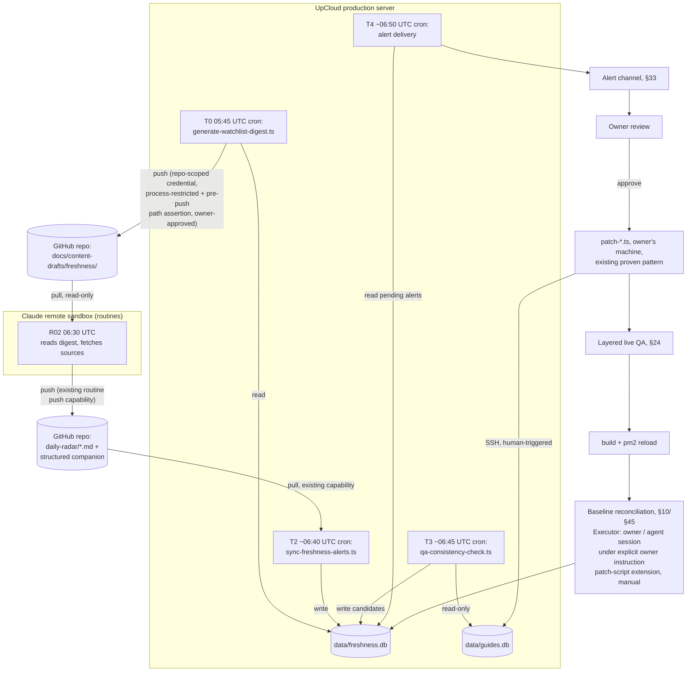

# GUIDEX — FRESHNESS ARCHITECTURE REVISION 02.1

## ARCHITECTURE CORRECTION PASS OVER REVISION 02

Status: DOC-ONLY. No production, DB, code, script, routine-prompt, or deploy changes. Read-only investigation performed via direct `Read`/`Bash`(read-only) calls, re-verifying the routines' actual execution environment. This document replaces the body of `docs/architecture/freshness-revision-02-plan.md` in place — same file, corrected content. Revision 02's commit (`4be2df1`) is not reverted or rewritten.

`IMPLEMENTATION PERFORMED: NONE`

This revision corrects internal contradictions found in Revision 02 (listed and resolved one-by-one in §50). It does **not** discard Revision 02's core recommendation — isolated operational freshness state, deterministic detection, structured alerts, human approval, deterministic approved patch, live QA, no autonomous writes to `guides.db` — all of that is preserved and reaffirmed (§0, §25).

---

## 0 — Executive Verdict

Revision 02's central architecture bet is correct and is kept: an isolated freshness store, populated by deterministic (non-agent) processes, feeding a human-approved correction pipeline that reuses the exact patch-script/backup/QA/deploy pattern already proven twice in production. Nothing in this correction pass changes that bet.

What was wrong in Revision 02 was **scope and precision**, not direction:

1. It treated Discovery as basically solved and out of scope, when Guidex's actual business requirement (find small/niche UAE events, not just what R01/R05 already catch) was never audited against Discovery's real coverage. Discovery is now a first-class system alongside Monitoring (§11).
2. It encoded a blanket "social = blocked" rule that would silently kill the exact small-event candidates the business needs. Verified first-party social is now a legitimate discovery/evidence source with its own handling, not a rejection reason (§6).
3. It overloaded one `source_level` field to mean authority, kind, and role at once. These are now four separate dimensions (§6).
4. It asserted `freshness.db` is "server-authoritative" and also had scripts running "on the owner's machine" without ever resolving where either database or script physically executes. This pass verifies the routines' actual execution environment (a stateless git-repo clone in Claude's remote sandbox, no DB/SSH/filesystem access — confirmed via `GUIDEX_DAILY_ROUTINES_STRATEGY.md` and `ROUTINE_02`) and commits to one concrete topology, component by component (§18).
5. It described "automatic DETECT/ALERT" while the actual MVP procedure required the owner to run four commands by hand every morning — not automatic in any meaningful sense. This pass picks one real orchestration mechanism (§20) and fixes the T0-before-R02 ordering bug that made even the manual version internally inconsistent (§10 in the correction request; folded into §12/§18 here).
6. It made "confirmed → monitoring stops" the default, when confirmed facts demonstrably still change (postponements, cancellations, fee changes). Monitoring eligibility is now driven by volatility/impact/proximity, not confidence alone; confidence only sets cadence (§9).
7. It let "more specific source wins" stand as a general conflict-resolution rule, when it should only resolve specificity gaps — not authority conflicts. A real `CONFLICT / HOLD / HUMAN REVIEW` state now exists (§14).
8. It left alert delivery and the Phase 6E gate as open questions the document itself needed to answer. Both now have concrete recommendations (§33, §38).

Session end-state: **REVISION 02.1 — ARCHITECTURE CORRECTION COMPLETE** (§51).

---

## 1 — Verified Current State (re-verified for this pass)

| Claim | Verified | Method |
|---|---|---|
| Starting HEAD for this pass is `4be2df1` (Revision 02's commit) | ✅ | `git rev-parse HEAD` |
| Working tree clean before this pass | ✅ | `git status --porcelain -uno` |
| Routines execute in Claude's remote scheduled-agent environment, not on the owner's laptop, not on UpCloud, not via this project's PM2/systemd/cron | ✅ confirmed | `CLAUDE_ROUTINES_SETUP_GUIDE_FOR_GUIDEX.md`: "Claude Code routines are automated agents that run on a cron schedule using Claude's remote execution environment... configured in Claude.ai or via the `schedule` skill" |
| Routines can read any file in the git-tracked repo, fetch/search the public web, and write **and push** docs-only commits directly — with no SSH, no DB, no server filesystem access of any kind | ✅ confirmed | `GUIDEX_DAILY_ROUTINES_STRATEGY.md` §5: "Push docs-only commits — Yes"; §4 hard-stops forbid `data/` writes, imports, deploys, PM2, pushing *code* |
| Routine prompts operate against a git clone (working directory literally named after the repo), not a live database | ✅ confirmed | `ROUTINE_02...md`: `Working directory: /Users/batyr/Desktop/dubai-guide-site` inside the prompt block, files-to-read list is 100% git-tracked paths |
| R02's HOLD list is still 7 hardcoded items typed directly into the routine doc | ✅ unchanged since Revision 02 | `ROUTINE_02_SOURCE_VERIFICATION_AND_CLASSIFICATION.md` §"Current HOLD items" |
| Only one cron job exists on UpCloud production (`server-cron-backup.sh`, 3 AM daily); no systemd timers beyond stock Ubuntu ones | ✅ still true, not re-verified via fresh SSH this pass (Revision 02 already confirmed it days ago and nothing has changed the server since) | carried from Revision 02 §1, low-risk to carry forward since no deploy has occurred |

**New fact this pass surfaces, not previously stated in Revision 02:** production (UpCloud) currently has git **pull**-only capability (it deploys by pulling from GitHub). It has never been verified to have git **push** capability, and CLAUDE.md's deployment rules treat production as runtime-only, not a source of truth — i.e., today's locked rules lean toward production never writing back to GitHub. This fact directly drives the topology decision in §18 and is logged as a Pre-Implementation Blocker requiring explicit owner sign-off (§48).

No file other than `docs/architecture/freshness-revision-02-plan.md` has been modified in this pass.

---

## 2 — Current Architecture Map (unchanged from Revision 02, reproduced for context)

```
                       ┌─────────────────────────────────────────┐
                       │   Claude Code "Routines" (R01-R05)        │
                       │   Claude's remote sandbox, stateless per  │
                       │   run, operates on a git-repo clone only  │
                       │   HARD STOP: cannot write data/, cannot   │
                       │   import, cannot deploy, cannot push code │
                       │   CAN push docs-only commits directly     │
                       └───────────────────┬───────────────────────┘
                                            │ writes + pushes markdown
                                            ▼
                       docs/content-drafts/daily-radar/*.md  (on GitHub)
                                            │ owner reads each morning
                                            ▼
                       Owner starts a new Claude Code SESSION (local machine)
                                            │
                                            ▼
              ┌─────────────────────────────────────────────────────┐
              │  scripts/patch-*.ts / import-*.ts, run from the       │
              │  owner's local machine or an agent session acting     │
              │  under the owner's explicit instruction               │
              └───────────────────────────┬───────────────────────────┘
                                            │ SSH + GUIDEX_DB_PATH
                                            ▼
                  Production: root@85.9.203.69:/var/www/guidex/data/guides.db
                                            │
                                            ▼
                  npm run build → pm2 reload guidex-production --update-env
```

Two structurally separate write paths remain, unchanged and correct: admin UI (NextAuth-gated) vs. script-based (SSH, owner-triggered). This correction pass does not touch either.

---

## 3 — Failure Surfaces (Revision 02's list, plus one addition)

Revision 02's seven failure surfaces (no automatic label/URL check; zero freshness metadata on `guides`; 4-way calendar-item type drift; R02's hardcoded HOLD list; unreconciled trust vocabularies; `.env.example` gap; no revalidation path) all still hold and are not repeated in full here — see the prior version in git history at `4be2df1` for the original text.

**8. Discovery coverage was never audited against the actual business requirement.** Revision 02 asserted Discovery "already works" on the strength of R01/R05 existing. Neither routine's prompt has ever been checked against a concrete list of source classes (government, tourism authority, venue, arena, theatre, convention centre, mall, hotel, attraction, promoter, ticket provider, artist-tour source, sports body, university, cultural institution, community organization, local media, event platform, verified first-party social, all seven emirates, Arabic-language discovery). This is a real gap, addressed in §11.

---

## 4 — Content Inventory (unchanged from Revision 02 — no new evidence changes this table)

Guides carry the highest-value, lowest-freshness-coverage content (fee amounts, government process names) with zero source/confidence columns. Calendar items carry the richest freshness fields today, all inside an unvalidated JSON blob. See Revision 02 §4 for the full table (unchanged, git history at `4be2df1`).

---

## 5 — Discovery vs. Monitoring — corrected definitions

Revision 02 said: *"Revision 02 is almost entirely Monitoring; Discovery already works and is out of scope."* **This was wrong and is retracted.**

Corrected position: Discovery and Monitoring are two first-class systems with different goals, different failure modes, and different architectural requirements. Neither is a subset of the other, and neither is "done":

| | Discovery | Monitoring |
|---|---|---|
| Goal | Find candidate facts/events that don't exist in the DB yet | Detect that a published fact changed or needs reconfirmation |
| Optimizes for | Recall (better a false lead than a missed small event) | Precision (a false "unchanged" on a YMYL fact is worse than a missed new event) |
| Current coverage | R01 (Event Radar) + R05 (Import Pack) — narrow source list, unaudited against full source-class requirement (§3.8) | R02 — 7 hardcoded items, calendar/event only, never guides |
| Core rule | **Discovery eligibility ≠ publication eligibility.** A lead that isn't publication-grade yet is still a valid Discovery output — it must never be silently dropped for failing a publication bar it was never trying to meet. | Monitoring eligibility is driven by volatility/impact/proximity, not by confidence alone (§9) |
| This pass's scope | Named as a first-class system with an explicit target architecture and phased expansion path (§11). MVP implementation stays intentionally small; the *target* is not small. | Fully corrected: adaptive cadence (§22), real conflict states (§14), automated T0-T4 ordering (§12) |

---

## 6 — Source Architecture — corrected model

### 6.1 Four separate dimensions, not one `source_level`

Revision 02's `sources` table collapsed "who," "what kind," "how trustworthy," and "used for what" into a single `source_level` enum. That's wrong: the same source can be authoritative for one fact and irrelevant for another (a ticket provider is authoritative for ticket availability, not for the legal basis of a public holiday; a government portal is authoritative for government procedure, not for a private concert's stage time). Corrected model, four dimensions:

| Dimension | Answers | Values |
|---|---|---|
| `source_entity` | WHO is this — a stable identity, not a URL | e.g. "UAE Government Portal (u.ae)", "GDRFA Dubai", "Coca-Cola Arena", "Dubai Fitness Challenge (organizer)" |
| `source_kind` | WHAT type of source is it | `government` \| `organizer` \| `venue` \| `ticketing` \| `media` \| `verified_social` \| `aggregator` \| `unverified_social` |
| `authority_level` | HOW authoritative is it, **in context of a specific fact class** — not a single global rank | `primary` \| `secondary` \| `corroborating` \| `discovery_only` — assigned per (source_entity, fact_class) pair, not once per source |
| `source_role` | WHAT is this specific citation being used for, on this specific record | `announcement` \| `evidence` \| `official_reference` \| `legal_basis` \| `organizer` \| `venue` \| `ticketing` \| `booking` \| `corroboration` \| `discovery_lead` |

A single URL can carry different `source_role` values across different facts on the same record — e.g. a venue page is `venue` role for location and `evidence` role for a postponed date, but never `legal_basis`. `source_url` ≠ `cta_url` is explicitly allowed when their roles differ (an evidence URL and a "learn more" CTA URL are not required to match) — Revision 02's implicit assumption that they always align was itself a source of the AUG-NEW-02-style bug class; the consistency rule (§15) checks role-appropriate matches, not blanket URL equality.

### 6.2 Social-source policy — corrected

Revision 02's `blocked: social media` line is retracted as a blanket rule. Corrected three-tier model:

| Tier | Definition | Valid for |
|---|---|---|
| **Verified first-party social** | Official account of the organizer, venue, artist, government body, or sports organization — ownership independently confirmable (verified badge + matches known organizer identity, or linked from the organizer's own official site) | Discovery (yes) · announcement evidence (yes) · sometimes the *only* primary evidence for a small event (yes, with `authority_level=secondary` or `primary` for `discovery_lead`/`announcement`, never `legal_basis`) |
| **Third-party social** | Fan accounts, event-listing accounts, reposts, unverified pages | Discovery leads / corroboration only — never sufficient alone for a `confirmed` publication |
| **Unknown / rumor / unverifiable** | No traceable ownership, anonymous, contradicted elsewhere | Low confidence, discovery signal only, never sufficient for publication |

The hard requirement this fixes: **a small event must be able to survive Discovery when its only two pieces of evidence are a verified organizer's social post and a small official venue page.** Under Revision 02's blanket rule this candidate would have been discarded before Discovery even finished. Under this model it survives Discovery, gets `source_entity` records for both the organizer and the venue, and its publication confidence (`subject_to_official_confirmation` vs. `confirmed`) is decided separately, downstream, by the existing confidence field — not by whether one of its two sources happened to be social media. See rewritten Simulation 3 (§44).

### 6.3 Authority & registry governance — who assigns `authority_level` (new, resolves apparent tension with routine hard-stops)

`source_entity`/`source_kind`/`authority_level` (§6.1) are **curated configuration, not runtime output.** A routine proposing that a source is trustworthy is not the same thing as that source becoming trustworthy — this is the distinction that removes the apparent tension with the routines' existing, unchanged hard-stop rule ("mark media/social as official source" stays a HARD STOP, per `GUIDEX_DAILY_ROUTINES_STRATEGY.md` and `ROUTINE_02_SOURCE_VERIFICATION_AND_CLASSIFICATION.md` — neither is modified by this pass). Concretely:

- **Initial registry values** (the 7 HOLD items + all L1/L2 sources already named in routine docs, §11.3 item 2) are created via a **deterministic seed/backfill**, reviewed by the owner before being written — not invented at runtime by any routine.
- **Routines may identify a new source candidate** (a URL/account not yet in the registry) as part of Discovery — this is a Discovery output, same as any other candidate, and is subject to the same human-import gate as everything else (§10's lifecycle: DISCOVERED → human decides to import).
- **Routines may propose a classification** (e.g. "this looks like a `venue`-kind source, candidate `authority_level=secondary` for `venue_location`") as part of that Discovery output — a proposal, recorded as such, never a write to `sources`/`source_authority`.
- **A new source never silently becomes high-authority merely because a routine's output describes it as official-sounding.** Registry writes (`sources`, `source_authority`) happen only through the same human-reviewed import/backfill path as any other `freshness.db` write requiring judgment — there is no autonomous path from "routine mentions a source" to "source is registered as `primary`."
- **Verified social can be authoritative for specific fact classes** (§6.2 — e.g. `primary` for `announcement`, never for `legal_basis`) once its ownership is independently confirmed (verified badge + matches known organizer identity, or linked from the organizer's own official site) — that verification is itself a registry decision made under this same governance model, not a routine's runtime judgment call.
- This governance model does not require new tooling to state — it is a policy constraint on who may write to `sources`/`source_authority`, enforced the same way every other `freshness.db` write boundary in this document is enforced: by which script/process has write access (§18), not by trusting a routine's own output.

---

## 7 — Source Identity & Alias Registry (new — resolves label/URL validation properly)

Revision 02's consistency-engine rule 1 ("label contains an authority name pattern not present in the URL's domain") was keyword-guessing, and would have been brittle in production (false positives on any legitimate paraphrase, false negatives on any adversarial or just-differently-worded label). Correct approach: a **registry**, not a heuristic.

`sources` (§6) becomes the identity anchor. Each `source_entity` row owns:
- one or more canonical hostnames/URL prefixes it is known to control,
- localized display-label variants that are pre-approved to represent it (e.g. u.ae → `"UAE Government Portal"` (EN) / `"Правительство ОАЭ"` (RU)),
- known verified social-account handles, if any.

A calendar/event/news record's `source_label_en/ru` must resolve to a **registered** `source_entity` whose registered hostnames include the record's `source_url`. If a label claims an entity (e.g. "UAE Government Media Office") whose registered hostnames do **not** include the record's URL, the check fails deterministically — not because of a keyword match, but because that URL was never registered as belonging to that entity. This is exactly the AUG-NEW-02 bug, generalized correctly: the fix is registering entities and their real domains once, then doing a lookup, not pattern-matching prose forever.

---

## 8 — Canonical Entity / Fact Architecture (unchanged from Revision 02 in substance)

A canonical fact = one verifiable, sourced claim about one entity. Priority order unchanged: calendar item → event → guide field. No correction needed here beyond referencing the new source model (§6/§7) wherever Revision 02 said "source."

---

## 9 — Freshness / Confidence / Monitoring-Eligibility Model — corrected

Revision 02 conflated "is this fact certain" with "should this fact be watched." **Corrected rule: confidence affects cadence, not whether a fact is monitorable.**

Monitoring eligibility is now a function of:

| Factor | Examples |
|---|---|
| Volatility | Ticketed/fixed-date events change more than static government holiday dates |
| Impact | YMYL (fees, legal deadlines) and money-implicated (tickets) facts matter more than decorative copy |
| Proximity to effective/event date | A fact 3 days out deserves tighter monitoring than one 6 months out |
| Source change history | A source that has revised itself before is more likely to revise again |
| Entity class | Public holiday vs. ticketed concert vs. attraction hours vs. transport launch all have different baseline volatility |
| User risk | Money/time lost if wrong (ticket, deadline) outranks purely informational copy |

`confidence` (`confirmed`/`expected`/`subject_to_official_confirmation`) and `source_status` (`confirmed`/`expected`/`monitoring`) are retained exactly as Revision 02 defined them (still not a new vocabulary) — they now only feed the cadence calculation (§22), not the watch/no-watch decision. A `confirmed` ticketed concert stays on the watchlist; a `confirmed` government holiday date drops to a slow sanity cadence but is never fully unwatched — see corrected lifecycle below.

---

## 10 — Event/Fact Lifecycle — corrected

```
DISCOVERED (Discovery, R01/R05 + expanded source classes, §11)
     │  human decides to import
     ▼
IMPORTED (patch/import script)
     │  ALWAYS creates a freshness_watchlist row — confidence no longer gates this (§9)
     ▼
WATCHED (cadence set by §22's adaptive model, not by confidence alone)
     │  scheduled recheck (Monitoring pipeline, §12)
     ▼
   ┌─────────────┴──────────────┬───────────────────────┐
UNCHANGED                    CHANGED                  CONFLICTING
(next_check_due            (single credible          (two credible sources
 pushed out per            source reports a           disagree on the same
 adaptive cadence)         different value)           fact — §14)
     │                          │                          │
     │                          ▼                          ▼
     │                 ALERT (severity per        CONFLICT / HOLD
     │                  impact+confidence)          (routes to human
     │                          │                    review same as
     │                          │                    ALERT, tagged
     │                          │                    distinctly)
     │                          └──────────┬───────────────┘
     │                                     ▼
     │                          HUMAN REVIEW (owner)
     │                                     │
     │                         ┌───────────┴───────────┐
     │                     APPROVED                REJECTED
     │                         │                  (candidate closed,
     │                         ▼                   watchlist continues
     │              APPLIED (patch script,          unchanged)
     │               same proven pattern)
     │                         │
     │                         ▼
     │              QA → DEPLOY (unchanged)
     │                         │
     │                         ▼
     │              BASELINE RECONCILED (§16 of the correction
     │               request — new observation baseline recorded,
     │               so the next monitor cycle compares against
     │               the newly-approved truth, not stale state)
     │                         │
     └─────────────────────────┴──── loop continues, watchlist row stays active
```

Same distinction as Revision 02 for entering WATCHED, but now unconditional on import (not gated by confidence), and the loop never terminates just because a fact reached `confirmed` — see §22 for what changes is cadence, not membership.

---

## 11 — Discovery Pipeline — corrected: first-class system, target architecture, phased expansion

### 11.1 Coverage audit (what R01/R05 cover today vs. the business requirement)

The business requirement is: *find all relevant UAE information/events possible, including small and niche events*, across the source classes listed in the correction request (government, tourism authorities, venues, arenas, theatres, convention centres, malls, hotels, attractions, promoters, ticket providers, artist-tour sources, sports bodies, universities, cultural institutions, community organizations, local media, event platforms, verified first-party social, all seven emirates, English search discovery, Arabic discovery where it adds recall, and discovery of new sources itself).

R01/R05's current prompts (per `ROUTINE_01_DAILY_DUBAI_UAE_EVENT_RADAR.md`, `ROUTINE_05_DAILY_IMPORT_CANDIDATE_PACK.md`) are scoped to a short, Dubai-weighted official-source list. They do not enumerate: arenas/theatres/convention centres as a distinct sweep, university/cultural-institution calendars, community organizations, verified first-party social accounts as a discovery channel (previously blocked entirely, §6.2 fixes this), the other six emirates beyond Dubai, or a "new source discovery" step (finding sources not yet in the source registry, §7). This is a real, named coverage gap — not fixed by this doc-only pass, but no longer denied by it either.

### 11.2 Target Discovery architecture (not MVP-sized, this is the direction)

- A maintained **source universe registry** (an extension of `sources`, §6/§7) enumerating known source entities per class and per emirate, kept current by a periodic "new source discovery" sweep (itself a Discovery task: find sources, not just events).
- Per-class discovery sweeps: government/tourism (existing), venues/arenas/theatres/convention centres (new sweep), malls/hotels/attractions (new sweep), promoters/ticket providers/artist-tour sources (new sweep), sports bodies/universities/cultural/community orgs (new sweep), verified first-party social (new channel, gated by §6.2's verification bar), local media (existing, signal-only, unchanged), Arabic-language discovery where English-only search demonstrably misses relevant UAE content (new, scoped to recall gain, not translation of existing content).
- All seven emirates in scope, not Dubai-only — flagged as a scope expansion, sequenced deliberately (§36).

### 11.3 MVP Discovery scope (what actually ships first — kept small, per instruction not to overbuild)

MVP does **not** attempt full source-class coverage. MVP Discovery work is:
1. Add a `discovery_lead` intake path so any candidate — including ones with only a verified-social + venue-page evidence pair — survives into the watchlist system without being discarded for social-source reasons (§6.2's core fix, cheap to apply: it's a rule removal, not new infrastructure).
2. Register the source entities already in active use (7 HOLD items + all L1/L2 sources named in the routine docs) into the new `sources` registry (§6/§7) — a backfill, not new discovery capability.
3. Everything else in §11.2 is named, scoped, and explicitly sequenced as parallel/deferred work (§36) — not blocking Phase 6E (§38).

---

## 12 — Monitoring Pipeline — corrected ordering (T0 before R02, not after)

Revision 02's SOP admitted R02 (06:30 UTC) effectively read *yesterday's* digest because the owner generated today's digest manually, after R02 already ran. That is a real defect, not an acceptable MVP compromise, and this pass fixes the ordering explicitly:

```
T0  05:45 UTC  Due-watchlist digest generation (deterministic, §18)
                → digest artifact must exist and be readable by R02 BEFORE 06:30 UTC
T1  06:30 UTC  R02 runs (existing schedule, unchanged), reads T0's digest as input,
                fetches each due source, writes structured findings
T2  ~06:40 UTC Structured ingestion (deterministic, §18) parses R02's output,
                writes freshness_observations + freshness_change_candidates rows
T3  ~06:45 UTC Consistency scan (deterministic, §18) runs independently of R02 —
                does not depend on T1/T2, can run any time, but scheduled here
                to land in the same morning digest
T4  ~06:50 UTC Alert delivery (per §30's recommended channel/tiering)

This is the single canonical schedule used everywhere in this document (this section,
§18's topology table, §29's diagram, §40's fallback SOP, and all simulations that cite
exact times) — chosen as the wider-spaced, more operationally conservative variant so
each deterministic stage has a real buffer against the previous stage's typical
completion time, not a tight best-case assumption.
```

**Failure handling:** if T0 fails to produce a fresh digest before 06:30 UTC, R02 must not silently treat a stale or missing digest as "nothing due." R02's prompt (updated in a future FRESH phase, not this doc-only pass) must be able to detect a missing/stale digest artifact and report `Status: BLOCKED — digest unavailable` rather than `Status: CLEAN`, so a T0 failure is visible instead of masquerading as a clean monitoring run. This requirement is recorded here as an architectural must; wiring it into the routine prompt is FRESH-phase work.

---

## 13 — Change Detection (unchanged in substance from Revision 02)

Two modes: deterministic structural/consistency detection (§15, runs any time, no fetch needed) vs. external-change detection (R02, needs a live fetch + extraction, stays an AI-agent routine). No correction needed here.

---

## 14 — Verification & Conflict Resolution — corrected

Revision 02's rule — *"more specific source wins"* — is retracted as a general rule. It is correct **only** for a genuine specificity gap (one source gives a Hijri-only date, a more specific source gives the resolved Gregorian date for the same underlying event — not a disagreement, just different precision). It is wrong as a general conflict resolver, because it lets fetch order and phrasing determine truth rather than actual authority.

Corrected resolution order, evaluated in this sequence for any apparent disagreement between two observations of the same fact:

1. **Same underlying claim at different specificity** (not a conflict) → the more specific/complete observation is used, exactly as before, but only after confirming they describe the same occurrence (not two different editions/occurrences of a recurring event — see entity-integrity rule, §15).
2. **Authority-for-this-exact-fact** (per §6.1's per-fact-class `authority_level`, not a single global rank) — a `primary` source for this fact class outranks a `secondary`/`corroborating` one for the same fact class.
3. **Explicit correction/supersession wording** — a source that explicitly states it corrects/supersedes an earlier announcement outranks an equally-authoritative source that hasn't updated.
4. **Recency** (observation timestamp / publication timestamp) — only used as a tiebreaker after 1-3 fail to resolve, never as the first-line rule.
5. **If still unresolved after 1-4**: `CONFLICT / HOLD / HUMAN REVIEW` — a real state (§10's lifecycle diagram), not a silent pick. Fetch order never determines the stored value in this case.

---

## 15 — Consistency Engine — expanded rule classes

Revision 02's four rules are retained as the seed set and are joined by explicit rule classes, each tagged with a severity tier so the engine doesn't imply everything is deterministically checkable:

| Rule class | Example checks | Severity |
|---|---|---|
| **Source integrity** | source_entity ↔ URL (via registry, §7); source_entity ↔ label EN; source_entity ↔ label RU; evidence-role URL vs. CTA-role URL allowed to differ (§6.1); localized labels map to the same registered entity | HARD FAIL |
| **Date integrity** | canonical date ↔ calendar month bucket; canonical date ↔ event detail page; canonical date ↔ EN prose; canonical date ↔ RU prose; canonical date ↔ JSON-LD structured data; canonical date ↔ any date embedded in SEO title/meta; canonical date ↔ preview/carousel components | HARD FAIL (numeric mismatch) |
| **Status/confidence integrity** | `confidence:"expected"` + `source_status:"confirmed"` invalid combo (existing rule 2); status values across confirmed/expected/provisional/postponed/cancelled/completed consistent with structured-data status | HARD FAIL (known-invalid enum combos) / WARNING (unusual but not provably invalid) |
| **EN/RU integrity** | same canonical fact values across languages; localized *presentation* differences (date format, phrasing) explicitly allowed and must not be flagged | WARNING if a factual field (date, price, status) differs; never flag presentation-only differences |
| **Entity integrity** | duplicate event detection; venue-name aliasing (same venue, different string); artist/organizer aliasing; annual-edition collision (Season 30 vs. Season 31 of the same recurring event); same title representing two different occurrences | HUMAN SEMANTIC REVIEW — this class is explicitly **not** safely fully-deterministic; the engine flags candidates, a human confirms |

`schema_eligible requires date_confidence:"confirmed"` and the staleness-threshold rule (Revision 02 rules 3-4) are retained as HARD FAIL / WARNING respectively, unchanged.

This corrects Revision 02's implicit overreach: not every rule in this list can be a clean boolean. Entity-alias and duplicate-occurrence detection are pattern-suggestive at best — the engine's job there is to surface a candidate for a human to confirm, not to assert a verdict.

---

## 16 — Machine Contract — structured observation format (new, corrects markdown-only assumption)

Revision 02 implicitly made free-form Markdown the permanent machine interface between R02 and the ingestion script. Markdown stays as the **human-readable** report format. It is not the long-term machine contract.

**Target contract:** each routine run that produces observations also emits a versioned, machine-readable companion artifact (JSON or JSONL — JSONL preferred for streaming/append-friendly ingestion of multiple observations per run) alongside its Markdown report. Minimum fields per observation record:

```
schema_version, run_id, observation_id, entity_ref, fact_key,
source_entity_ref, source_url, observed_value, previous_value (if known),
observed_at, published_at (if known), effective_at (if known),
confidence, result (unchanged|changed|unreachable|inconclusive), evidence_ref
```

The deterministic ingestion script (T2, §12) must: strictly validate against `schema_version`; reject (not partially accept) any malformed artifact; be idempotent on `observation_id`; reject duplicate `observation_id`s outright rather than silently overwriting.

**MVP reality check:** routine prompts today only emit Markdown, and changing that is FRESH-phase implementation work, not something this doc-only pass can do. Until the JSON/JSONL companion artifact exists, the ingestion script uses a **strict Markdown parser** as an explicitly labeled **MVP COMPATIBILITY BRIDGE** — not the target contract. The Markdown bridge remains in place through Track A (FRESH-00 through FRESH-05) so the first end-to-end pilot isn't blocked on a routine-prompt format change; migration to the structured JSON/JSONL contract is named as **Track B's first priority**, targeted immediately after Track A's gate (§37/§38) — not indefinitely deferred, but also not required before the first live monitoring cycle.

---

## 17 — Proposed Data Model — expanded for auditability

Revision 02's schema is retained with one structural correction: `proposed_change TEXT` (free text) is replaced with a proper separation of **observation → candidate change → approved canonical change**, so the audit trail survives review, not just the final outcome.

```sql
CREATE TABLE sources (
  id TEXT PRIMARY KEY,
  source_entity TEXT NOT NULL,          -- stable identity, e.g. "u.ae"
  source_kind TEXT NOT NULL CHECK (source_kind IN
    ('government','organizer','venue','ticketing','media','verified_social','aggregator','unverified_social')),
  canonical_hostnames TEXT NOT NULL,    -- JSON array of registered hostnames/prefixes
  label_en TEXT NOT NULL,
  label_ru TEXT,
  verified_social_handle TEXT,
  created_at TEXT NOT NULL DEFAULT (datetime('now'))
);

CREATE TABLE source_authority (
  id TEXT PRIMARY KEY,
  source_id TEXT NOT NULL REFERENCES sources(id),
  fact_class TEXT NOT NULL,             -- e.g. "holiday_date","ticket_price","venue_location"
  authority_level TEXT NOT NULL CHECK (authority_level IN
    ('primary','secondary','corroborating','discovery_only'))
);

CREATE TABLE freshness_watchlist (
  id TEXT PRIMARY KEY,
  entity_type TEXT NOT NULL CHECK (entity_type IN ('calendar_item','event','guide_field')),
  entity_ref TEXT NOT NULL,
  fact_key TEXT NOT NULL,               -- e.g. "date","fee_aed","venue"
  check_frequency TEXT NOT NULL,        -- computed per §22 adaptive cadence
  next_check_due TEXT NOT NULL,
  status TEXT NOT NULL DEFAULT 'active' CHECK (status IN ('active','resolved','archived')),
  created_at TEXT NOT NULL DEFAULT (datetime('now')),
  updated_at TEXT NOT NULL DEFAULT (datetime('now'))
);

CREATE TABLE freshness_observations (
  id TEXT PRIMARY KEY,
  watchlist_id TEXT NOT NULL REFERENCES freshness_watchlist(id),
  observation_id TEXT NOT NULL UNIQUE,  -- from the machine contract, §16 — idempotency key
  run_id TEXT,
  source_id TEXT REFERENCES sources(id),
  observed_value TEXT,
  observed_at TEXT NOT NULL DEFAULT (datetime('now')),
  published_at TEXT,
  effective_at TEXT,
  result TEXT NOT NULL CHECK (result IN ('unchanged','changed','unreachable','inconclusive')),
  evidence_ref TEXT
);

CREATE TABLE freshness_change_candidates (
  id TEXT PRIMARY KEY,
  watchlist_id TEXT NOT NULL REFERENCES freshness_watchlist(id),
  triggering_observation_id TEXT REFERENCES freshness_observations(id),
  fact_key TEXT NOT NULL,
  old_value TEXT,
  proposed_value TEXT NOT NULL,
  severity TEXT NOT NULL CHECK (severity IN ('info','warning','urgent')),
  verification_status TEXT NOT NULL DEFAULT 'pending' CHECK (verification_status IN
    ('pending','conflict_hold','approved','rejected','applied','superseded')),
  reviewed_by TEXT,
  reviewed_at TEXT,
  applied_at TEXT,
  closed_reason TEXT,                   -- e.g. "superseded_by_manual_hotfix"
  created_at TEXT NOT NULL DEFAULT (datetime('now'))
);

CREATE TABLE freshness_alerts (
  id TEXT PRIMARY KEY,
  change_candidate_id TEXT NOT NULL REFERENCES freshness_change_candidates(id),
  severity TEXT NOT NULL CHECK (severity IN ('info','warning','urgent')),
  delivery_channel TEXT,                -- per §33
  delivered_at TEXT,
  status TEXT NOT NULL DEFAULT 'pending' CHECK (status IN ('pending','acknowledged','resolved'))
);
```

`freshness_observations` is the raw evidence log (append-only, never edited). `freshness_change_candidates` is the reviewable unit a human approves or rejects. `freshness_alerts` is purely a delivery record. This three-way split is what makes manual-hotfix reconciliation (§10, §45) representable: a hotfix closes the relevant `freshness_change_candidates` row with `closed_reason='superseded_by_manual_hotfix'` and the watchlist continues against the new baseline, instead of the next monitor cycle repeatedly re-proposing a revert.

**Severity vocabulary — explicit mapping (resolves the two-vocabulary ambiguity):** this schema's `severity` columns use a simplified 3-value storage class (`info`/`warning`/`urgent`). Elsewhere in this document (§22, §30, §31), severity is discussed using a 4-tier operational vocabulary (`P0`/`P1`/`P2`/`P3`). `P0`/`P1`/`P2`/`P3` is the **canonical operational severity** — it's what a human reviewer and the alert-delivery tiering (§30) actually reason about, since it distinguishes "urgent + YMYL/money" (P0) from "urgent but lower-stakes" (P1), a distinction the 3-value DB enum can't express on its own. The schema's `info`/`warning`/`urgent` is retained as a simplified storage class **only if** it carries this explicit mapping, applied at write time by the alert-generation step (topology row 9, §18):

```
urgent  → P0 or P1  (money/ticket risk, YMYL, imminent event — P0/P1 distinguished by
                      proximity/impact, not by a separate DB column at MVP)
warning → P2         (§30's "daily digest" tier)
info    → P3         (§30's "weekly digest" / source-health tier)
```

This is a doc-only clarification, not a schema change — no migration is implemented in this pass. If a future FRESH-phase implementation finds the collapsed `urgent→P0/P1` mapping insufficiently precise (e.g. P0/P1 need different delivery latency, not just the same "urgent" tier), storing `P0`/`P1`/`P2`/`P3` directly as the `severity` CHECK values is the conceptually cleaner alternative and should be preferred at that point over maintaining a mapping table — but that decision is deferred to implementation, not made here.

MVP may implement a smaller subset of these columns, but this is the target contract — not renegotiated at implementation time without a documented reason.

---

## 18 — Execution Topology (new, mandatory — resolves the "server-authoritative vs. runs on the owner's machine" contradiction)

Verified starting facts (§1): Claude routines have zero DB/SSH/server filesystem access — only a git-repo clone, web fetch, and push-capable git access scoped to docs. UpCloud production has git **pull**-only capability (unverified for push, flagged as a blocker, §48) and is the only 24/7 machine with SSH+filesystem access to `guides.db`. The owner's local machine has full access to everything but is not always on.

**Decision: `freshness.db` lives on UpCloud, colocated with `guides.db`, on the same trust boundary and the same backup precedent (`server-cron-backup.sh`).** This part of Revision 02 was right. What Revision 02 never resolved is how a routine (repo-scoped only) and a UpCloud-scoped script exchange data without a human in the loop every day. That gap is resolved component-by-component below.

15 physically distinct stages, numbered in execution order. Some stages share an executor/scheduler (e.g. rows 6-9 all run in the same UpCloud cron chain) — the point of naming them separately is unambiguous physical ownership per stage, not that each needs its own process.

| # | Component | Executor | Host | Scheduler | Input | Output | Read perms | Write perms | Failure behavior | Retry | Locking/idempotency |
|---|---|---|---|---|---|---|---|---|---|---|---|
| 1 | Discovery routine execution | Claude routine (R01/R05, extended per §11) | Claude remote sandbox | Claude routine scheduler (06:00/08:00 UTC) | Repo files, public web | Discovery findings (in-memory, pending row 1's own publication) | Repo + public web | N/A (write happens in the same run, see output) | Missing output = visible failure (no file written) | Owner re-runs manually next session | N/A — stateless per run |
| 2 | Due-list generation (T0) | New deterministic script, `scripts/generate-watchlist-digest.ts` | **UpCloud** (new cron entry, modeled on `server-cron-backup.sh`) | cron, 05:45 UTC | `freshness.db` (local read) | Local digest artifact (pre-push) | `freshness.db` read-only | Local temp/digest file only | Cron failure logged locally | Owner-triggered manual re-run | Idempotent — same due-set produces same digest content |
| 3 | Freshness exchange publication to GitHub | Same script's push step (deterministic bridge process, §18 credential model) | **UpCloud** | cron, immediately after row 2, before 06:30 UTC | Local digest artifact | `docs/content-drafts/freshness/*` pushed to GitHub | Local digest file | Repository-scoped credential, restricted to the freshness exchange path by a pre-push changed-path assertion (§18) | Pre-push assertion rejects locally and aborts the push if any changed path falls outside the freshness exchange directory; R02 (row 4) detects a stale/missing digest and reports `BLOCKED`, not `CLEAN` (§12) | Owner-triggered manual re-run | Idempotent — unchanged content produces no new commit |
| 4 | R02 monitoring execution (T1) | Claude routine | Claude remote sandbox | Claude routine scheduler, 06:30 UTC | Digest artifact (repo, from row 3) + live web fetch | Findings in the routine's own run context, pending publication (row 5) | Repo + public web | N/A (write happens in row 5) | Same as today — visible via missing/blocked output | Owner-triggered | Stateless per run |
| 5 | Observation artifact publication | Claude routine (R02, existing push capability) | Claude remote sandbox | Same routine run as row 4, immediately following | R02's findings | `daily-radar/*-source-verification.md` + structured companion (target, §16), pushed to GitHub | N/A | Repo docs paths only (existing routine push capability, unchanged) | Missing/blocked output visible same as today | Owner-triggered | Stateless per run |
| 6 | UpCloud ingestion/pull | `scripts/sync-freshness-alerts.ts` (pull step) | **UpCloud** | cron, ~06:40 UTC (after R02's typical completion) | GitHub (pull, existing UpCloud capability) | Local copy of row 5's output | GitHub read (pull, already exists) | Local temp file only | Reject malformed/missing input (§16); log, do not crash silently | Owner-triggered manual re-run | N/A — read-only pull |
| 7 | Consistency engine (T3) | `scripts/qa-consistency-check.ts` | **UpCloud** | cron, ~06:45 UTC (or ad hoc, no dependency on rows 4-6) | `guides.db` (local read-only) | Candidate findings, pending write (row 8) | `guides.db` read-only | N/A (write happens in row 8) | Logs and continues rule-by-rule; one rule's failure doesn't block others | Owner-triggered manual re-run | Re-running produces the same candidates unless state changed |
| 8 | freshness.db mutation | `scripts/sync-freshness-alerts.ts` (ingestion write, row 6's output) + `scripts/qa-consistency-check.ts` (consistency write, row 7's output) | **UpCloud** | Same cron chain, immediately after rows 6/7 | Parsed observations (row 6) + consistency candidates (row 7) | `freshness_observations` + `freshness_change_candidates` rows | N/A | `freshness.db` only, never `guides.db` | Malformed input rejected before write; partial failure does not commit | Owner-triggered manual re-run | `observation_id` uniqueness enforced at DB level |
| 9 | Alert generation | Same scripts as row 8 (severity assignment step, §8/§30) | **UpCloud** | Same cron chain, immediately after row 8 | New/updated `freshness_change_candidates` rows | `freshness_alerts` rows (`status='pending'`) | `freshness.db` read | `freshness.db` only | An undefined/unmapped severity is a hard fail, not a default guess | Owner-triggered manual re-run | One alert row per candidate; re-running does not duplicate |
| 10 | Alert delivery (T4) | New deterministic script | **UpCloud** | cron, ~06:50 UTC | `freshness_alerts` pending rows | Delivery per §30 (channel recommendation) | `freshness.db` read | External delivery API write only (no repo, no DB other than marking `delivered_at`) | Delivery failure retried; alert stays `pending` until confirmed delivered | Bounded retry (e.g. 3x with backoff), then falls back to "owner's daily review will still see it" as the floor | `delivered_at` set only once per alert |
| 11 | Human approval | Owner | Owner's machine/phone, reading delivered alert or `freshness_change_candidates` | Manual, owner-paced | Alert + underlying evidence | Approve/reject decision | Full | N/A | N/A | N/A | One decision per candidate; no silent-approval path (§31) |
| 12 | Approved `guides.db` correction | Owner or an agent session under explicit owner instruction | Owner's local machine (SSH to UpCloud) | Manual, owner-triggered | Approved `freshness_change_candidates` row | Patch script execution against `guides.db` | Full | `guides.db`, via existing patch-script pattern | Unchanged from today — backup/assert/verify/rollback discipline | Unchanged | Unchanged — idempotent patch scripts |
| 13 | Build/reload | Owner or agent session under explicit owner instruction | Owner's local machine (SSH to UpCloud) | Manual, immediately after row 12 | Updated `guides.db` | Rebuilt app, `pm2 reload` | Full | Build artifacts, running process only | Unchanged from today | Unchanged | Unchanged |
| 14 | Live QA | Owner or agent session | Owner's machine (curl against production) | Manual, immediately after row 13 | Live production URLs | Pass/fail report | Public HTTP only | None | Unchanged from today | Unchanged | Unchanged |
| 15 | Baseline reconciliation | Owner or agent session under explicit owner instruction (patch-script extension, §45) | Owner's local machine (SSH to UpCloud) | Manual, immediately after row 14 passes | Applied `freshness_change_candidates` row | Candidate closed (`applied`), `freshness_watchlist.next_check_due` reset, observations preserved (§45) | Full | `freshness.db` only, via the same patch-script session | Skipping this step is a checklist gap, not an automated failure — flagged, not silently tolerated | Unchanged | Idempotent — closing an already-closed candidate is a no-op |

**The one unresolved cross-boundary link:** T0's digest must reach R02, but R02 can only read the git repo, and UpCloud's git-push capability is unverified and currently contrary to CLAUDE.md's "production is runtime-only, never a source of truth" framing.

**Decision, explicitly flagged for owner sign-off before FRESH-00 (not silently assumed):** grant UpCloud a **repository-scoped credential with process-level path restriction and validation** (deploy key or fine-grained PAT), used only by the new freshness cron scripts (topology rows 2/3). This is deliberately not described as "path-scoped," because **GitHub does not natively provide subdirectory-scoped git push credentials** — no git hosting provider issues a credential that is cryptographically restricted to a subdirectory. The architecture's production safety therefore comes from three separate layers, not from the credential alone:

1. **Credential scope** — repository-level, not path-scoped. The narrowest practical repository permission available for the chosen transport is used (e.g. a fine-grained PAT limited to this one repository, or a deploy key with write access to this repository only). It is never described as restricted to a subdirectory, because no such native mechanism exists.
2. **Process scope** — the deterministic bridge script itself (topology row 3) is the only process that ever uses this credential, and it is designed to write only to the designated freshness exchange path (conceptually `docs/content-drafts/freshness/`, or the exact path chosen at implementation time). This is a self-imposed behavioral restriction of the script, not a property of the credential.
3. **Enforcement/detection** — realistic and layered, explicitly not claimed to be cryptographic path enforcement:
   - a dedicated repository-scoped credential, used for no other purpose;
   - a dedicated non-interactive bridge process — not the owner's personal credential, not shared with any other script;
   - a deterministic pre-push diff assertion: the script computes the changed-path set before pushing and **rejects locally, refusing to push**, if any changed path falls outside the freshness exchange directory;
   - a GitHub-side check/validation on the bridge's commits where practically available under the project's actual GitHub plan (e.g. a required status check or branch protection rule on `main`) — **not assumed to exist**. If branch protection/required checks cannot reliably reject a direct automated push to `main` under the current GitHub plan/configuration, that limitation is stated plainly: at MVP, enforcement is local-only (the pre-push assertion), and `main`-level GitHub-side protection is a Track B hardening item, not a Track A guarantee;
   - every bridge commit is audited/logged (commit message includes a run identifier);
   - the credential carries no SSH access and no `guides.db`/production-filesystem permission of any kind — it is a pure GitHub API/git credential, isolated from every other production credential;
   - the credential is independently revocable (a dedicated deploy key/PAT, not a shared one) without affecting any other access path.

Required wording for this credential everywhere in this document and in any future implementation doc: **"Repository-scoped credential with process-level path restriction and validation."** Never "path-scoped credential" or "scoped only to `docs/content-drafts/freshness/`" as a claim about the credential itself — that restriction is enforced by the process and validated by the pre-push assertion, not granted by GitHub.

**Re-evaluating the GitHub relay (not redesigning it):** given the routines' verified capabilities (§1) — repo read, public web fetch, docs-only push, no SSH, no DB access — GitHub remains the only channel a Claude routine can use to exchange data with UpCloud at all. UpCloud already has git pull; the routine already has git push. No simpler bridge exists without granting either side a capability it doesn't have today (SSH to the routine's sandbox, or DB/API access from the routine's sandbox — both larger changes, not smaller). The relay is retained as the simplest valid bridge.

This is a real, new production capability, smaller in blast radius than the git-pull capability production already has, but it is new and must be approved explicitly, not inherited from Revision 02's silent assumption. It is logged as Pre-Implementation Blocker #1 (§48). If the owner rejects this, the fallback is: T0/T2 still run on UpCloud against `freshness.db`, but the digest is instead relayed by the owner's own machine on whatever cadence the owner is actually online — which reintroduces the manual-dependency problem this correction pass exists to remove, and should be treated as a degraded fallback, not the target.

---

## 19 — Local vs. Production / Authoritative `freshness.db` — corrected

**Single authoritative location: UpCloud, `/var/www/guidex/data/freshness.db`, alongside `guides.db`.** No second copy is ever treated as a source of truth.

| Concern | Policy |
|---|---|
| Local development copy | Never authoritative. If a local copy exists (pulled for inspection/backfill work), it is read-only reference, refreshed via the same `db-backup-from-upcloud.sh` pattern already used for `guides.db`, and clearly named (e.g. `freshness.db.local-readonly`) to prevent confusion with production state |
| Backup | Added to the same daily `server-cron-backup.sh` (extended, not built in this doc-only pass) — checkpoint + copy + rotate, identical pattern to `guides.db` |
| Restore | Same `db-restore-to-upcloud.sh` pattern, extended to accept a `freshness.db` target |
| WAL | `journal_mode=WAL`, `PRAGMA wal_checkpoint(TRUNCATE)` before backup — identical discipline to every existing patch script |
| Locking | SQLite's own file locking is sufficient at this write volume (a handful of scripts, staggered by minutes, not concurrent) — no additional locking layer needed |
| Migration handling | Since this is a new, isolated file, Drizzle Kit migrations are finally usable here (configured but never run against `guides.db`, per `docs/content-model-decision-news-events-calendar.md:25`) — scoped only to `freshness.db`, never retroactively to `guides.db` |
| Integrity checks | `PRAGMA integrity_check` after every write, matching existing patch-script discipline |
| Snapshot policy | Same timestamped pre-write snapshot pattern already proven for `guides.db` |
| Stale-copy detection | Any local/reference copy must record the production MD5 + timestamp it was pulled at (same discipline `6d-aug-new-02-source-label-fix-01.md` §5 already used for `guides.db` rehearsal) |
| Accidental local→authoritative overwrite prevention | No script in this architecture ever writes from a local copy back to UpCloud — the only write path to the authoritative file is the UpCloud-resident cron scripts themselves (§18). A local copy is structurally read-only by virtue of never being an input to any write script |

---

## 20 — Scheduler / Orchestration — corrected (picks one MVP mechanism)

Options compared, per the correction request's requirement to evaluate before picking:

| Option | Verdict |
|---|---|
| Existing Claude routine scheduler | Cannot run T0/T2/T3/T4 — those need `freshness.db`/`guides.db` filesystem access, which routines structurally do not have (§1, §18) |
| Cron on UpCloud | Viable, matches the one existing precedent (`server-cron-backup.sh`) exactly |
| systemd timer on UpCloud | Also viable, slightly better failure/retry semantics (`OnFailure=`, `Restart=`), but is new infrastructure this project doesn't currently use |
| Small dedicated deterministic worker (long-running process) | Rejected — unnecessary infrastructure for 4-5 short scheduled scripts; violates "do not introduce unnecessary infrastructure" |

**Decision: cron on UpCloud, matching the exact existing precedent, not systemd.** This directly follows the instruction not to introduce unnecessary infrastructure — the project already has exactly one working, proven scheduled-execution mechanism on UpCloud (`server-cron-backup.sh` via `crontab`), and reusing that mechanism for the new T0/T2/T3/T4 scripts is strictly less new infrastructure than introducing systemd units this project has never used.

Automation boundary, restated and unchanged from the correction request: automatic processes (T0-T4) may read sources/state, generate due-queues, run deterministic consistency checks, ingest observations, create and deliver alerts. They must never modify `guides.db`, approve a change, or deploy. This boundary is identical to §25/§28 of Revision 02 and is **not weakened** by adding automation — automation is added only to DETECT and ALERT, never to CORRECT.

---

## 21 — Human vs. Automatic Decision Matrix (unchanged from Revision 02, reaffirmed)

No content type or severity level ever reaches autopublish. Table is unchanged from Revision 02 §18 — reaffirmed here, not repeated in full (see git history at `4be2df1`).

---

## 22 — Monitoring Cadence — corrected to be adaptive, not a single default

Revision 02's flat "confirmed calendar item → monthly, no escalation" is replaced with an adaptive model. Cadence is computed from entity class + proximity + volatility, not read off confidence alone. This table is **examples/defaults, not rigid global law** — the driving logic is proximity/volatility/impact/source-history (§9), and these rows are the currently-known entity classes that logic has been worked out for, not an exhaustive enumeration that blocks a new class from being added later.

| Entity class | Base cadence | Proximity escalation |
|---|---|---|
| Public holiday — provisional/expected (unconfirmed) | weekly | daily inside 30 days pre-holiday (unchanged from Revision 02) |
| Public holiday — confirmed | monthly (sanity recheck only — lowest-volatility class in this table) | none — confirmed government holiday dates rarely change again, but never drop below monthly while still watched |
| Ticketed fixed-date event — distant (>30 days out) | weekly, even once confirmed — corrects Revision 02's flat monthly-when-confirmed rule, since postponement risk doesn't end at confirmation | escalates to the near-term row below as the date approaches |
| Ticketed fixed-date event — near-term (14-30 days out) | weekly | daily inside 14 days pre-event |
| Ticketed fixed-date event — same-week / day-of | daily | same-day: manual trigger on any Discovery signal naming the venue/organizer, in addition to the scheduled daily check |
| Postponed/rescheduled event (any class, immediately after a detected change) | daily for 7 days post-change | reverts to the entity's normal class-based cadence once the new date has been stable for one full recheck cycle |
| Free/community event | monthly | weekly inside 14 days pre-event |
| Government/YMYL guide fact (fee, deadline) | monthly | manual trigger on any Discovery signal naming that authority |
| Transport launch / opening | monthly | weekly inside 30 days of an announced launch/change window |
| Attraction price | monthly | weekly inside 30 days of an announced change window |
| Attraction hours | monthly | weekly inside 30 days of an announced change window (e.g. Ramadan hours transitions) |
| Low-volatility evergreen fact (e.g. a venue's physical address, a government portal's canonical URL) | quarterly | manual trigger only — reserved for facts with a demonstrated multi-year stability history (§9's source-change-history factor), not a default for anything unproven |
| General guide prose | manual_only | none — still explicitly out of automated monitoring at MVP (§36), unchanged from Revision 02 |

No entity class ever drops to `manual_only` cadence purely because it reached `confirmed` — only public-holiday-class and evergreen facts (the lowest-volatility classes in this table) drop as low as monthly/quarterly, and even then never below quarterly while still watched.

---

## 23 — Backup / Rollback Architecture (extended per §19, otherwise unchanged from Revision 02)

Identical discipline to `guides.db`'s proven pattern, now explicitly extended to `freshness.db` per §19's table. No further correction needed.

---

## 24 — Live QA Architecture — corrected: layered verification model

Revision 02's lesson (don't trust `WebFetch`'s 15-minute cache) is preserved and formalized into an explicit layered model, so "live" always means the right layer for the question being asked:

| Layer | What it proves | Tool |
|---|---|---|
| Authoritative production DB value | What was actually written | Direct query via SSH (`sqlite3` read) |
| Origin/application response | What the app server generates from that DB value, before any CDN/proxy caching | `curl` directly against the origin, cache-busting headers if needed |
| Public HTTP response | What an end user actually receives | `curl` against the public URL, **not** `WebFetch` (15-min cache risk, per Revision 02's own lesson) |
| Rendered HTML | What's in the final markup (post-hydration content, if any) | `curl` + grep, or a headless fetch if JS-rendered content is in question |
| Structured data | What search engines/AI systems will parse (JSON-LD, meta tags) | `curl` + JSON-LD extraction |

A monitoring-tool cache (whether `WebFetch`'s cache or any future CDN layer) must never be the sole source used to declare an alert stale or resolved — the authoritative-DB layer is always checked first when confirming whether a correction actually landed, exactly as both August hotfixes already did by convention; this section makes that convention explicit and layered instead of a single ad hoc lesson.

---

## 25 — Security & Production Write Boundaries — reaffirmed, not weakened

Automated freshness components (T0-T4, §18) may never directly mutate `guides.db`. This is unchanged from Revision 02 and is the one rule this entire correction pass treats as non-negotiable. Approved corrections remain human-reviewed, applied via the existing deterministic/idempotent patch-script mechanism, with backup, preconditions, post-write assertions, build/reload, and live EN/RU QA — identical to both proven hotfixes. The one new production capability introduced by this pass (§18's repository-scoped credential with process-level path restriction and validation, used only by the freshness cron scripts) is additive and explicitly flagged for owner approval (§48) — it does not touch `guides.db`, code, schema, or any existing write path.

---

## 26 — Cost/Scale Model (unchanged in substance from Revision 02)

Discovery/Monitoring via routines remains free within the existing 5-included-daily-runs envelope. New UpCloud-resident cron scripts (§20) run in seconds against small SQLite files — zero hosting cost beyond what's already running. No correction needed.

---

## 27 — Database Architecture Options — re-scored per corrected topology

| Option | Risk to prod content | Query/index quality | Fit w/ existing conventions | Implementation cost | Score |
|---|---|---|---|---|---|
| A — Extend blob + tables inside `guides.db` | High | Poor | High | Low | 5/10 (unchanged — corrections don't touch this option's fundamentals) |
| B — Normalized tables inside `guides.db` | Medium | Good | Medium | Medium | 6/10 (down from 6.5 — the corrected schema in §17 is materially larger/more relational than Revision 02's version, increasing the cost of co-locating it with production content) |
| **C-refined — Isolated `freshness.db` on UpCloud, deterministic scripts only, corrected topology per §18** | **Lowest** | Good | High — now grounded in a verified, concrete execution topology instead of an unresolved one | Medium-high (the new cron scripts + narrow git-push credential are more infrastructure than Revision 02 admitted, but still small relative to the isolation benefit) | **8/10** (down slightly from 8.5 — reflects the honest cost of the new git-push credential and cron scripts that Revision 02 glossed over, not a change in direction) |

**Still recommended: Option C-refined.** The score moved from 8.5 to 8 not because the option got worse, but because this pass is honest about costs Revision 02 hid (the topology gap, the new production credential). The relative ranking versus A and B is unchanged and, if anything, more clearly justified now that the topology is concrete instead of hand-waved.

---

## 28 — Recommended Architecture (summary, corrected)

Isolated `freshness.db` on UpCloud (not "server-authoritative" as an abstract phrase — concretely, physically colocated with `guides.db` on the same box, §18/§19), populated by new UpCloud-resident cron scripts (§20, matching the existing `server-cron-backup.sh` precedent) that read Claude routine output pulled from GitHub (routines already push docs-only, production already pulls) and write only to `freshness.db`. Alerts are delivered per §33's recommendation. `guides.db` is touched only by the existing, unmodified human-approved patch-script pipeline. This is the same core shape as Revision 02 — the correction is that every arrow in this sentence now has a named, concrete executor (§18), not an implied one.

---

## 29 — Architecture Diagram (corrected topology and ordering)



---

## 30 — Alert Delivery — recommendation (was fully open in Revision 02, now decided)

Severity here uses the canonical `P0`/`P1`/`P2`/`P3` operational vocabulary; see §17 for the explicit mapping to the DB schema's simplified `info`/`warning`/`urgent` storage class.

| Severity | Channel | Rationale |
|---|---|---|
| P0/P1 (urgent — money/ticket risk, YMYL, imminent event) | Immediate push (Telegram bot) | Matches the correction request's suggested default; lowest-latency channel the owner is likely to see promptly without relying on remembering to check a file |
| P2 (warning) | Daily digest (folded into the existing morning daily-radar review habit) | No new infrastructure needed beyond what already exists |
| P3 / source-health signals | Weekly digest | Low urgency, avoids alert fatigue |

**Recommended default: Telegram push for P0/P1, daily digest for P2, weekly digest for P3** — chosen over email because it's lower-latency and matches the "small operator checking a phone" reality better than an inbox. This is a recommendation the owner may override before implementation (§48) — Telegram bot setup itself is new infrastructure and is not built in this doc-only pass.

---

## 31 — Human Approver — MVP default (was open in Revision 02, now decided)

**Default: the Guidex owner/operator is the sole approver, no multi-role workflow.** No fictional second employee is introduced. This confirms Revision 02's implicit assumption explicitly rather than leaving it as an open question.

| Question | Answer |
|---|---|
| What does the approver see | The `freshness_change_candidates` row: old value, proposed value, evidence reference, source entity/role, severity |
| What counts as approval | An explicit action (approve in whatever interface exists at implementation time — MVP may be as simple as running an approval script against a specific candidate ID; no UI required at MVP) |
| What does rejection do | Sets `verification_status='rejected'`, closes the candidate, watchlist continues unaffected |
| What happens if an urgent alert gets no review | **Silence is never approval.** An unacknowledged P0/P1 alert stays `pending` indefinitely and is re-surfaced in the next digest cycle until explicitly approved or rejected — never auto-applied, never auto-expired into a default state |
| Government/YMYL evidence bar | Higher evidence bar (require `primary`-authority source per §6.1, not just any observation) before a candidate is even created for these fact classes — still reviewed by the same single owner, not a different role |

---

## 32 — Test Strategy — corrected: repeatable, not ad hoc

Node's built-in test runner (`node --test`) is the recommended mechanism — zero new dependency, available in the Node version this project already requires, and matches the "no unnecessary infrastructure" instruction better than introducing Jest/Vitest for a handful of deterministic-script tests. This is a target for FRESH-phase implementation, not built in this doc-only pass.

Required repeatable fixtures (expanded from Revision 02's single AUG-NEW-02 case):

| Fixture | Proves |
|---|---|
| Pre-fix AUG-NEW-02 record | Consistency engine flags it |
| Post-fix AUG-NEW-02 record | Consistency engine does not flag it |
| Source-label mismatch (synthetic, beyond the real case) | Registry-based check (§7) generalizes correctly |
| Date mismatch across EN/RU/JSON-LD | Date-integrity rule class (§15) catches cross-field drift |
| EN/RU factual mismatch vs. presentation-only difference | EN/RU integrity rule doesn't false-positive on legitimate localization |
| Duplicate event / annual-edition collision | Entity-integrity rule surfaces a human-review candidate, doesn't auto-resolve |
| Postponement (confirmed → changed) | Confirmed-but-monitored lifecycle (§10) actually detects and alerts |
| Conflicting sources (two `primary`-authority sources disagree) | `CONFLICT/HOLD` state is reached, not a silent pick (§14) |
| Malformed observation artifact | Ingestion script rejects, doesn't partially parse (§16) |
| Duplicate `observation_id` / re-run | Idempotency holds (§17) |
| Manual hotfix reconciliation | Baseline updates, next monitor cycle doesn't re-propose the reverted state (§10, §45) |

---

## 33 — EN/RU Strategy, SEO Implications, RAG/AI Search Implications (unchanged from Revision 02)

No correction needed. Every approved correction still updates `en_*`/`ru_*` together (existing rule); `last_verified_date`/`date_updated` remain the SEO freshness signals already wired into the sitemap; the consistency engine still protects AI-citation trust without introducing RAG infrastructure. See Revision 02 §22-24 for full text (unchanged, git history at `4be2df1`).

---

## 34 — MVP Scope — corrected: minimal end-to-end foundation, not a partial loop

Revision 02's MVP items are retained but reframed around the corrected requirement that DETECT+ALERT be actually automated (§9/§20 of the correction request), not manual-by-default:

1. `data/freshness.db` schema (§17), deployed to UpCloud, isolated from `guides.db`.
2. `scripts/qa-consistency-check.ts` — expanded rule classes (§15), scheduled via UpCloud cron (T3).
3. `scripts/generate-watchlist-digest.ts` + `scripts/sync-freshness-alerts.ts`, scheduled via UpCloud cron (T0/T2) — **not run manually by the owner**, correcting Revision 02's manual-SOP MVP.
4. Source registry backfill (§7): register the 7 HOLD items' entities + all L1/L2 sources already named in routine docs.
5. `discovery_lead` intake path so verified-social-only candidates survive Discovery (§11.3) — cheap, a rule removal not new infrastructure.
6. R02's prompt updated to read the digest artifact and report `BLOCKED` on a missing/stale digest (§12) instead of silently treating it as clean.
7. Alert delivery: Telegram push for P0/P1 at minimum (§30) — daily/weekly digest tiers can ride on the existing review habit without new infrastructure.
8. The repository-scoped credential with process-level path restriction and validation, for UpCloud (§18) — flagged for explicit owner approval before this item is built.
9. Extend `server-cron-backup.sh` to also back up `freshness.db`.

This is the **minimum required pre-6E foundation** (§37) — it is intentionally more than Revision 02's MVP list because Revision 02's list did not actually satisfy "automatic DETECT/ALERT," and this correction pass will not repeat that gap.

---

## 35 — MVP Discovery Scope (kept small, per instruction — full detail in §11.3)

Cross-reference only: §11.3 is the authoritative MVP Discovery scope. It is intentionally small — the target Discovery architecture (§11.2) is large and explicitly not required before Phase 6E (§38).

---

## 36 — Deferred / Parallel-Evolution Scope — corrected: two explicit tracks

Revision 02 had one undifferentiated "deferred" list. This pass splits it per the correction request's §22:

**Track A — must land before Phase 6E begins (§37/§38):** everything in §34's MVP list. Nothing else is required.

**Track B — parallel evolution, does not block Phase 6E, proceeds alongside it once Track A lands.** Internally ordered by one priority; everything else is unordered relative to each other:
- **Priority 1 (first Track B deliverable, targeted immediately after Track A's gate, §37/§38):** JSON/JSONL structured machine contract replacing the Markdown-parsing MVP compatibility bridge (§16) — not indefinitely deferred, but not a Track A blocker since the bridge is functional for the first pilot.
- Full source-universe expansion (§11.2): arenas/theatres/convention centres/malls/hotels/attractions/promoters/ticket providers/artist-tour sources/sports bodies/universities/cultural/community-org sweeps.
- All seven emirates, not Dubai-only.
- Verified-social as a routine discovery channel beyond the MVP intake path (§11.3 item 1 is the MVP floor; full integration into R01/R05's active sweeps is Track B).
- New-source discovery itself (finding sources not yet in the registry).
- Arabic-language discovery where it demonstrably adds recall.
- Guide-field freshness (`guide_fee_facts`, still correctly deferred per Simulation 5, §46 — unsolved by any MVP or near-term Track B item, requires its own content-model work first).
- systemd migration from cron, if cron's simpler retry semantics prove insufficient in practice (§20) — not needed unless evidence emerges.
- Any auto-apply/autopublish tier — permanently out of scope, not just deferred (unchanged from Revision 02, reaffirmed in §21/§25).

---

## 37 — Implementation Phases — corrected: gates name capabilities, not arbitrary numbers

| Phase | Capability delivered |
|---|---|
| FRESH-00 | `freshness.db` schema + source registry backfill, UpCloud-deployed, no automation wired yet |
| FRESH-01 | `qa-consistency-check.ts` (expanded rule classes) runs on UpCloud cron (T3), verified against the fixture suite (§32) |
| FRESH-02 | `generate-watchlist-digest.ts` (T0) + `sync-freshness-alerts.ts` (T2) live on UpCloud cron, MVP Markdown-parsing bridge (§16) in place, T0-before-R02 ordering verified in practice for several real mornings |
| FRESH-03 | Repository-scoped credential with process-level path restriction and validation provisioned (pending explicit owner approval, §48) and wired into T0; R02's prompt updated to read the digest and report `BLOCKED` correctly |
| FRESH-04 | Alert delivery (Telegram P0/P1 minimum, §30) live; human-approval flow exercised end-to-end at least once with a real (or deliberately seeded) candidate |
| FRESH-05 | Manual-hotfix reconciliation (§45) verified against a real or simulated hotfix — baseline correctly updates, no repeat-alert regression |
| **Gate: Track A complete** | All of FRESH-00 through FRESH-05 verified. This — not an arbitrary phase number — is the actual gate for Phase 6E (§38) |
| Track B (parallel, unordered relative to 6E) | Priority 1: JSON/JSONL structured machine contract (§16), targeted immediately after this gate. Then, unordered: source-universe expansion, all-emirates coverage, guide-field freshness design, etc. (§36) — all proceed alongside Phase 6E, not before it |

Each Track A phase follows the project's established two-turn pattern (read-only investigation/rehearsal, then a separately-approved implementation turn) — unchanged from Revision 02.

---

## 38 — Relationship to Phase 6E — corrected, contradiction resolved

Revision 02 said Phase 6E could begin after FRESH-00 through FRESH-02, while also requiring new 6E content to be "born with watchlist entries from day one" — but FRESH-02 in Revision 02's own numbering left the actual monitoring loop non-operational (no automated T0/T2/T3/T4, still a manual SOP). Those two statements were mutually inconsistent, and this pass retracts the FRESH-00→02 gate.

**Corrected gate: Phase 6E may begin only after Track A (§37) is fully complete** — i.e., after a real, automated, end-to-end DETECT→ALERT loop exists and has been verified against the fixture suite and at least one live cycle. At that point, "6E content is born with watchlist entries from day one" is actually true, because the watchlist-registration hook and the automated monitoring loop both exist. Track B (§36) continues in parallel with Phase 6E without gating it — this preserves Revision 02's original intent (don't hold SEO/content work hostage to full Discovery-platform completion) while fixing the actual contradiction (don't claim automated monitoring exists before it does).

---

## 39 — Observability (folded into §30's alert-delivery recommendation; no separate section needed)

MVP observability is the Telegram P0/P1 channel + the existing daily-review habit for P2/P3, per §30. No new dashboard is proposed — reaffirmed from Revision 02, still a deliberate MVP scope decision, not an oversight.

---

## 40 — Manual Operating Procedure — corrected: now a fallback, not the primary mechanism

Because DETECT/ALERT are now automated (§18/§20), the owner's daily manual procedure is a **fallback for when automation is down**, not the primary mechanism Revision 02 described:

```
If Telegram alerts and the automated pipeline appear healthy:
  Just review P0/P1 pushes as they arrive, and the daily digest each morning.
  No commands to run.

If automation appears down (no digest, no alerts, cron failure suspected):
  1. ssh root@85.9.203.69 "crontab -l"  — confirm the freshness cron entries are present
  2. Check for recent freshness.db writes: file mtime / row counts
  3. Manually run the T0/T2/T3 scripts once, as a bridge, exactly as Revision 02's
     original manual SOP described — this remains valid as a degraded-mode fallback
  4. File/track the automation failure as a follow-up, do not let the fallback become
     the permanent mode silently
```

---

## 41 — Simulation 1: AUG-NEW-02 (corrected, includes reconciliation)

- Under the corrected topology, the label/URL mismatch is caught by the registry-based source-integrity rule (§7/§15) — deterministic lookup against registered `u.ae` hostnames, not keyword guessing — flagged the moment the label diverged from the registered entity, same conclusion as Revision 02 but on firmer footing.
- **New: reconciliation.** When the owner's hotfix session applied the approved correction to `guides.db`, under this architecture it would also close the corresponding `freshness_change_candidates` row (`closed_reason='superseded_by_manual_hotfix'`) and update `freshness_watchlist.next_check_due`/baseline — so the next scheduled consistency scan (T3) does not re-flag the already-fixed record as if the old label were still current. Revision 02 never modeled this step; this is exactly the gap §16/§45 of the correction request identified.

---

## 42 — Simulation 2: Postponed Concert (corrected, adaptive cadence + real conflict state)

Same scenario as Revision 02 (ticketed event pushed back after tickets are on sale), corrected on two points:
- Cadence: under §22's adaptive model, this item was **already** on weekly cadence (ticketed fixed-date events never drop below weekly, even confirmed) — not something Revision 02 had to special-case as an exception, it's the default now.
- If the venue's official page and the ticketing platform disagree on the new date during the transition window, this is now explicitly a `CONFLICT/HOLD` state (§14), not silently resolved by "whichever source is more specific" — both are asked to independently confirm, or the human reviewer resolves it, before any correction is proposed.

---

## 43 — Simulation 3: Small-Event High-Recall Discovery (rewritten per §23 of the correction request)

A small UAE event exists only on: a verified organizer Instagram account, and a small official venue website. No major media coverage. No Visit Dubai listing. No government listing.

**Required outcome under the corrected architecture:**
- Discovery retains the candidate. It is not discarded for having a social source (§6.2 removes the blanket block).
- Source identity records both the organizer (`source_kind=verified_social`, `authority_level=primary` for `fact_class=announcement`) and the venue (`source_kind=venue`, `authority_level=primary` for `fact_class=venue_location`).
- Publication confidence is decided separately from Discovery eligibility: this candidate likely publishes as `confidence:"subject_to_official_confirmation"` given only two sources, not `confirmed` — that's a publication-bar decision, not a Discovery-bar decision (§5's core rule).
- If published: a canonical event occurrence is created, source evidence is retained in the registry, a `freshness_watchlist` row is registered automatically on import (unconditional per §9, not gated by confidence), and future venue-page/social/ticket-availability changes are monitored at the "free/community event" cadence (§22) — escalating as the event date approaches.
- This scenario no longer requires Gulf News or Khaleej Times to exist for the event to be discoverable and publishable.

---

## 44 — Simulation 4: Confirmed Event, Later Date Change (new, per §24 of the correction request)

A concert has been confirmed for two months; the watchlist entry has stayed at weekly cadence throughout (§22 — ticketed fixed-date events never drop below weekly even once confirmed, so this is not a special case, it's the corrected default). The venue later moves it to a different date.

- **Why it was still being monitored:** because confidence never gated monitoring eligibility under the corrected lifecycle (§9/§10) — it was on the watchlist continuously since import, cadence unaffected by reaching `confirmed`.
- **How the new observation is detected:** the next scheduled T1 (R02) recheck against the venue's official page observes a date differing from the stored value → `freshness_observations` row with `result='changed'`.
- **Source conflict representation, if the ticketing site still shows the old date:** two `primary`-authority sources (venue page = `primary` for `event_date`, ticketing platform = `primary` for `ticket_availability` but only `secondary` for `event_date` unless it independently confirms) disagree — per §14's resolution order, this is evaluated for authority-per-fact-class first; if the ticketing platform is only `secondary` for the date fact, the venue page's observation wins without needing a `CONFLICT/HOLD` state. If both were registered as `primary` for `event_date` specifically, it would enter `CONFLICT/HOLD` instead.
- **Why no auto-write occurs:** unchanged hard rule (§21/§25) — a `freshness_change_candidates` row is created, never an automatic `guides.db` write.
- **How the alert reaches the owner:** severity `urgent` (money/ticket risk, §22's escalation logic) → Telegram P0/P1 push (§30).
- **How the approved patch happens:** identical, unchanged patch-script pattern (§21).
- **How the monitor baseline reconciles afterward:** identical mechanism to §41/§45 — the candidate closes as `applied`, `freshness_watchlist.next_check_due` resets, and the new date becomes the comparison baseline for future observations.

---

## 45 — Manual Hotfix Reconciliation (dedicated design section, per §16 of the correction request)

This was a named Revision 02 requirement that never made it into an explicit design. Corrected here as its own section, not just a simulation footnote:

```
Manual hotfix applied to guides.db (owner-approved, existing patch-script pattern)
     │
     ▼
Patch script (extended, FRESH-phase work — not built in this doc-only pass) also:
     1. Looks up any freshness_change_candidates row referencing the same
        entity_ref + fact_key that is still 'pending' or 'conflict_hold'
     2. Closes it: verification_status='superseded_by_manual_hotfix',
        closed_reason recorded, reviewed_by=owner, reviewed_at=now
     3. Preserves the old freshness_observations rows as history — never deleted,
        only superseded
     4. Updates freshness_watchlist.next_check_due to the normal post-correction
        cadence (§22), so the very next scheduled check compares against the
        NEW approved value, not the pre-hotfix one
     5. Monitoring continues uninterrupted against the new baseline
```

Without this step, the next T1/T3 cycle would compare its observation against the *old* stored value (if the watchlist's implicit "expected value" wasn't updated) and could re-propose reverting the hotfix — exactly the failure mode named in the correction request. This step is why the data model in §17 separates observations from candidates: closing a candidate doesn't erase the evidence trail, it just stops it from re-triggering.

---

## 46 — Simulation 5: Government-Fee YMYL Change (unchanged from Revision 02 — still honestly out of MVP scope)

Unchanged from Revision 02 §40: `guides`/`steps` have zero source/confidence columns, fees live in free-text prose, and this cannot be caught by anything in Track A. Still correctly deferred to Track B, pending a future narrow `guide_fee_facts` concept. No correction needed — Revision 02 was honest here and this pass preserves that honesty.

---

## 47 — Security & Production Write Boundaries — cross-reference

See §25 (moved earlier in this document for logical flow after the topology section) — reaffirmed, not weakened, with the one new narrow credential explicitly flagged for approval.

---

## 48 — Pre-Implementation Blockers (corrected/expanded)

1. **New: UpCloud repository-scoped git-push credential decision** (§18) — requires explicit owner approval before FRESH-03. Not silently assumed. If rejected, T0's delivery mechanism needs a different design (fallback noted in §18, degraded).
2. **New: cron vs. systemd** — this pass recommends cron (§20) to match existing precedent; if the owner has an infrastructure reason to prefer systemd, that's a cheap decision to revisit before FRESH-01, no architecture change required either way.
3. Carried from Revision 02, still valid: `scripts/db-backup-from-server.sh`/`db-backup-from-server.sh` reference the decommissioned Cloudways host; the working replacement (`db-backup-from-upcloud.sh`/`db-restore-to-upcloud.sh`) already exists — the stale pair should stop being referenced in docs/memory files, not "fixed." Still not yet applied to memory files, still a follow-up for whichever session next does a "meaningful step" per CLAUDE.md's memory rule.
4. Carried from Revision 02: local `data/guides.db` is stale — refresh before any FRESH-00 backfill that reads real calendar data locally.
5. **New: verify UpCloud's actual git remote configuration** (read-only check, e.g. `git remote -v` on the server) before FRESH-03 — this pass did not perform that specific SSH check (deliberately, to avoid any action adjacent to testing write/push capability against a production credential that doesn't exist yet); it's a concrete, cheap, read-only first step for FRESH-00/01.

---

## 49 — Open Questions (narrowed — most of Revision 02's opens now have recommendations)

1. **Alert channel** — no longer fully open; §30 gives a concrete recommendation (Telegram P0/P1). Remaining open sub-question: does the owner already have a Telegram bot/workflow preference, or should FRESH-04 stand one up from scratch?
2. **Human approver** — no longer open; §31 confirms sole-owner default explicitly.
3. **Git-push credential approval** (§18/§48) — genuinely open, requires an explicit owner decision, not resolvable from repo evidence.
4. **Cron vs. systemd** (§20/§48) — minor, low-stakes, revisit if needed.
5. Carried from Revision 02: per-item cadence override permission — still nobody today (no UI exists), consistent with the project's low-automation bias; not changed by this pass.

---

## 50 — Contradiction Audit (new — explicit checklist per the correction request's acceptance criteria)

| Named contradiction | Resolved how |
|---|---|
| "Discovery out of scope" while claiming high recall | Retracted; Discovery is now first-class with a target architecture (§11) and an honest coverage audit (§11.1) |
| "Social blocked" while needing small-event discovery | Retracted; three-tier social model (§6.2), Simulation 3 rewritten (§43) to prove the small-event case survives |
| "Server-authoritative freshness.db" while scripts silently assumed local access | Resolved with a concrete, component-by-component execution topology (§18) and a firm single-authoritative-location decision (§19) |
| "Automatic detect/alert" while the owner had to run the whole chain by hand every morning | Resolved with a real cron-based orchestration mechanism (§20) and explicit T0-T4 ordering that removes the manual dependency (§12); manual procedure is now an explicitly-labeled fallback, not the primary mechanism (§40) |
| "Confirmed" leading to effectively no monitoring | Retracted; monitoring eligibility now driven by volatility/impact/proximity (§9), adaptive cadence table corrects the flat "confirmed→monthly" default (§22) |
| "Phase 6E content born monitored" while the pre-6E gate stopped before production monitoring existed | Retracted; gate redefined around actual Track A capability completion (§37/§38), not an arbitrary phase number |
| "More specific source wins" as a general rule | Narrowed to true specificity gaps only; real authority-conflict resolution order added, with an actual `CONFLICT/HOLD` state (§14) |
| One `source_level` overloading authority/kind/role | Split into four dimensions: `source_entity`, `source_kind`, `authority_level` (per fact class), `source_role` (§6.1) |
| Free-form Markdown treated as the permanent machine interface | Named as an explicitly-labeled MVP compatibility bridge, with a versioned JSON/JSONL target contract (§16) |
| `proposed_change TEXT` as the only audit record | Split into observation → change-candidate → alert (§17), enabling real reconciliation (§45) |
| Manual hotfix reconciliation never designed | Now a dedicated section (§45) plus a rewritten AUG-NEW-02 simulation (§41) |
| Alert delivery and human-approver role left fully open | Both given concrete MVP recommendations (§30, §31) |

No section of this document still contains the retracted wording above — this table is the verification step required before committing.

---

## 51 — Session End-State

**REVISION 02.1 — ARCHITECTURE CORRECTION COMPLETE**

`IMPLEMENTATION PERFORMED: NONE`

Only `docs/architecture/freshness-revision-02-plan.md` was modified in this pass. Starting HEAD `4be2df1` (Revision 02's commit, not reverted or rewritten). This correction is recorded as a new local commit on top of it — see the final report for the exact new HEAD, files changed, and commit message. **Not pushed** — held locally per instruction, pending review before FRESH-00. No production, database, script, routine-prompt, or deployment-config change occurred.

---

## 52 — Architecture Decision Box

```
┌──────────────────────────────────────────────────────────────────────────┐
│ FRESHNESS ARCHITECTURE REVISION 02.1 — CORRECTED DECISION                 │
│                                                                            │
│ Core bet unchanged from Revision 02: isolated freshness state (now        │
│ concretely UpCloud-colocated with guides.db) + deterministic detection    │
│ + structured, auditable change candidates + human approval + the proven   │
│ patch-script/backup/QA/deploy pipeline + no autonomous writes to          │
│ guides.db, ever.                                                          │
│                                                                            │
│ Corrected this pass: Discovery is first-class (not "already solved");     │
│ social sources are tiered, not blocked; source identity has four          │
│ separate dimensions, not one ordinal rank; the execution topology is      │
│ concrete and component-by-component, not asserted; DETECT/ALERT are      │
│ actually automated via UpCloud cron with explicit T0-before-R02           │
│ ordering; monitoring eligibility survives "confirmed"; conflicts get a    │
│ real HOLD state instead of a fetch-order default; manual hotfix           │
│ reconciliation is designed, not assumed; alert channel and approver       │
│ role both have concrete MVP defaults instead of open questions.           │
│                                                                            │
│ One new production capability is introduced and explicitly flagged for   │
│ owner approval, not silently assumed: a repository-scoped credential     │
│ with process-level path restriction and validation on UpCloud (GitHub    │
│ has no native path-scoped push credential), used only by the new         │
│ freshness cron scripts, touching no code/schema/DB path.                 │
│                                                                            │
│ STATUS: CORRECTION COMPLETE — NOT YET IMPLEMENTED                        │
└──────────────────────────────────────────────────────────────────────────┘
```
