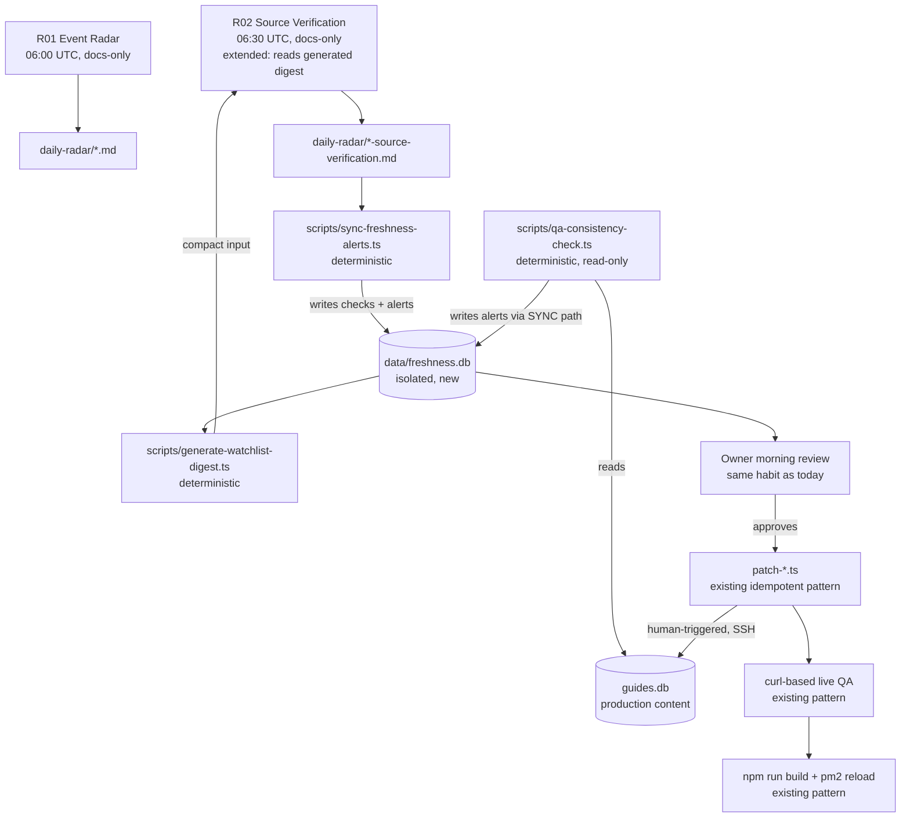

# GUIDEX — FRESHNESS ARCHITECTURE REVISION 02

Status: PLAN-ONLY. No production, DB, code, or deploy changes were made while producing this document. Investigation was read-only (Explore agents + direct read-only `git`/`ssh`/`Read` calls). This is the sole repo file created for Revision 02, followed by exactly one docs-only commit.

`IMPLEMENTATION PERFORMED DURING FRESHNESS ARCHITECTURE REVISION 02: NONE`

---

## 0 — Executive Verdict

Two production hotfixes this week (Mawlid date confirmation, then the AUG-NEW-02 source-label/URL mismatch) both followed the same shape by hand: a human-run **DETECT → ALERT → HUMAN REVIEW → APPROVED CORRECTION → QA → DEPLOY** cycle, using idempotent patch scripts, timestamped backups, and curl-based live QA. That workflow already works. Revision 02 does not need to invent a new operating model — it needs to make the DETECT and ALERT stages **automatic and structured** instead of manual and ad hoc, while leaving HUMAN REVIEW → CORRECTION → QA → DEPLOY exactly as already proven.

The project already has a real, running discovery layer: five Claude Code "routines" (R01–R05, Phase 6C-92) that scan sources on a schedule and write markdown reports. What's missing is (a) a structured, queryable place for freshness state to live (today it's either hardcoded in a routine's prompt file, like the 7 HOLD items in R02, or absent entirely, like the `guides` table which has zero source/confidence columns), and (b) a generalized consistency-check rule (the exact class of bug that caused AUG-NEW-02) that runs automatically instead of being caught by a manual read-only audit.

**Recommended architecture (§28):** a new, isolated `data/freshness.db` (normalized tables, Option C-refined, §27) populated by a **deterministic, non-agent parser script** that reads the routines' existing structured markdown output — never by the routines themselves, and never touching `guides.db`. This requires zero change to the routines' existing absolute hard-stop rules and adds a queryable watchlist/alert layer without increasing the blast radius of any automated process touching production content.

Session end-state: **REVISION 02 — PLAN COMPLETE** (§43).

---

## 1 — Verified Current State (independently re-verified, not trusted from handoff report)

| Claim | Verified | Method |
|---|---|---|
| Local branch `main`, HEAD `3dd198a` | ✅ matches | `git rev-parse HEAD` |
| `origin/main` HEAD `3dd198a` | ✅ matches | `git ls-remote origin main` |
| Production HEAD `3dd198a` | ✅ matches | `ssh root@85.9.203.69 "cd /var/www/guidex && git rev-parse HEAD"` |
| PM2 `guidex-production` online, stable | ✅ online, `restart_time=3`, `unstable_restarts=0` | `pm2 jlist` on production |
| No rollback occurred | ✅ consistent — clean fast-forward history, no revert commits | `git log` |
| AUG-NEW-02 fix closed | ✅ `CHECKPOINTS.md` entry `CP-PHASE6D-AUG-NEW-02-SOURCE-LABEL-FIX-01` present and consistent with commit history | file read |
| Only a daily 3 AM DB-backup cron exists on production; no app-level scheduler | ✅ confirmed — `crontab -l` shows exactly one line (`server-cron-backup.sh`), `systemctl list-timers` shows only stock Ubuntu timers, no custom unit | ssh read-only |

**One discrepancy found and corrected (not a blocker):** the AUG-NEW-02 hotfix report (`docs/content-drafts/seo/6d-aug-new-02-source-label-fix-01.md`, §15 "Remaining Issues") states `scripts/db-backup-from-server.sh` "needs updating to the UpCloud target ... in a future session." Independent verification shows this is already solved under different filenames: `scripts/db-backup-from-upcloud.sh` and `scripts/db-restore-to-upcloud.sh` already exist (dated April 29, predating both hotfixes), both correctly targeting `SERVER="85.9.203.69"`. The stale `-from-server.sh`/`-to-server.sh` pair (Cloudways, decommissioned) should simply stop being used/documented, not "fixed" — the working replacement already exists. This is a documentation correction, recorded here, not made in the memory files (out of scope for this plan-only turn — flagged in §41).

No code, schema, config, or documentation file other than this one has been touched in this turn.

---

## 2 — Current Architecture Map

```
                       ┌─────────────────────────────────────────┐
                       │        Claude Code "Routines" (R01-R05)   │
                       │  external cron, remote agents, docs-only  │
                       │  HARD STOP: cannot write data/, cannot    │
                       │  import, cannot deploy, cannot push code  │
                       └───────────────────┬───────────────────────┘
                                            │ writes markdown
                                            ▼
                       docs/content-drafts/daily-radar/*.md
                       docs/content-drafts/source-ledgers/*.md
                                            │ owner reads each morning
                                            ▼
                       Owner starts a new Claude Code SESSION (this pattern)
                                            │
                                            ▼
              ┌─────────────────────────────────────────────────────┐
              │  scripts/patch-*.ts / import-*.ts (idempotent, raw   │
              │  better-sqlite3, assert-before/verify-after pattern) │
              └───────────────────────────┬───────────────────────────┘
                                            │ SSH + GUIDEX_DB_PATH
                                            ▼
                  Production: root@85.9.203.69:/var/www/guidex/data/guides.db
                  (guides, steps, news_posts, events, calendar_pages tables;
                   calendar item freshness fields live inside calendar_pages
                   .dates_json as an unvalidated JSON blob — see §4)
                                            │
                                            ▼
                  npm run build → pm2 reload guidex-production --update-env
                  (fully static rendering; no revalidate/ISR anywhere)
```

Two structurally separate write paths exist today and must stay separate: **admin UI writes** (`lib/db/news-events-calendar-admin.ts`, gated by NextAuth via `proxy.ts`, matcher covers only `/admin/guides*` and `/admin/content*`) and **script-based writes** (SSH + `GUIDEX_DB_PATH`, used for all calendar/freshness patches so far, no admin UI exists for individual calendar-item field edits). Revision 02 must fit into the script-based path — it has no reason to touch the admin UI.

---

## 3 — Failure Surfaces (what actually breaks today, evidenced)

1. **No source/label consistency check runs automatically.** The AUG-NEW-02 bug (label names one authority, link resolves to another) existed in production for an unknown period before a manually-requested read-only audit caught it. Nothing in the build, the admin-save validation (`lib/admin-validation/news-events-calendar.ts`), or any routine checks label/URL semantic consistency.
2. **Zero freshness metadata on `guides`.** The `guides`/`steps` tables (schema.ts) have no `source_url`, `confidence`, or `last_verified_date` columns at all — only `calendar_pages` and `events` have any. A stale AED fee or a changed MOHRE process step inside a guide has no mechanism to be flagged, ever (this is the exact shape of Simulation 4, §40).
3. **The calendar item JSON shape has drifted into four incompatible declared types** (public reader `CalendarDateItem`, AI-draft `CalendarDateEntry`, mock-data `CalendarDateItemExtended`, and real production JSON which is wider than all three — confirmed via `scripts/patch-6d-calendar-batch-01-aug-nov-dec.ts`). `parseDatesJson()` does a raw `JSON.parse` cast with no runtime validation. Any freshness system that reads this blob inherits this drift risk.
4. **R02's HOLD list is hardcoded prose**, not data — 7 items typed directly into `ROUTINE_02_SOURCE_VERIFICATION_AND_CLASSIFICATION.md`. Adding an 8th monitored fact means editing a routine's prompt file by hand; there is no "add to watchlist" primitive.
5. **At least four overlapping, unreconciled source-trust vocabularies exist** in docs: calendar `confidence` (5 values), Public Holiday Radar `source_label` (8 values), News Signal Radar `source_reliability` (5 values), hub-plan `source_label` (binary), AI-editorial-plan `source_type` (7 values). None of the docs attempt to unify them. A Revision 02 schema that adds a fifth vocabulary would make this worse.
6. **`.env.example` omits 7 environment variables that `lib/ai/editor-runtime.ts` actually depends on** (`ANTHROPIC_API_KEY`, `AI_EDITOR_ENABLED`, etc.). If any freshness component calls the Anthropic API directly (rather than via a routine, which uses Claude Code's own auth), this gap must close first.
7. **No cache/revalidation path exists for calendar/news/events** (`lib/revalidate.ts` only handles `/guides/*`) — confirmed no `revalidatePath`/`revalidateTag` call anywhere tied to calendar saves. Combined with fully static rendering and no `revalidate` export, every DB-only content fix requires a full `npm run build` + `pm2 reload` — as both August hotfixes had to do. Any automated correction path inherits this cost; it cannot be "instant."

---

## 4 — Content Inventory (freshness-relevant surface)

| Content type | Table | Freshness fields today | Volume (approx, from CHECKPOINTS) |
|---|---|---|---|
| Guides | `guides` + `steps` | **None** | 15 guides, ~94 steps |
| News | `news_posts` | `source_url`, `source_label` (default `"media"`, free text) | not tracked in memory files |
| Events | `events` | `date_confidence` (DB column, CHECK-constrained), `source_url` | not tracked |
| Calendar items | `calendar_pages.dates_json` (blob) | `confidence`, `source_status`, `source_url`, `cta_url`, `source_label_en/ru`, `risk_level`, `lifecycle`, `noindex_after` — all inside unvalidated JSON | 97 items across Jul–Dec 2026 (Aug=15 most recently touched) |
| Calendar page (container) | `calendar_pages` | `official_source_url`, `last_verified_date` (real columns, with a 14/90-day staleness *warning* at admin-save time only — `lib/admin-validation/news-events-calendar.ts:497-511`) | 6 monthly pages |

Guides are the highest-value, lowest-freshness-coverage surface: they carry AED fee amounts and government process names (YMYL-adjacent, per CLAUDE.md's Content Writing Standard) with zero mechanism to detect when MOHRE/GDRFA/ICA changes a fee or a process step.

---

## 5 — Discovery vs. Monitoring (definitions used throughout this document)

- **Discovery**: finding *new* candidate facts/events that don't exist in the DB yet (what R01 "Event Radar" and R05 "Import Candidate Pack" already do). High recall is the goal; false positives are cheap (a human filters the daily pack).
- **Monitoring**: rechecking facts *already published* to detect that they changed or were confirmed/resolved (what R02 already does, but only for 7 hardcoded HOLD items, and only for calendar/event content — never for guides). High precision matters more here: a false "nothing changed" on a YMYL fact is worse than a missed new event.

Revision 02's scope, by design, is almost entirely **Monitoring** — Discovery (R01/R05) already works and is out of scope for change except where its output format needs to feed the new watchlist (§10).

---

## 6 — Source Architecture

Reuse the routines' existing hierarchy (`GUIDEX_DAILY_ROUTINES_STRATEGY.md` §6) as the single source-trust vocabulary going forward, rather than inventing a fifth:

| Level | Meaning | Examples |
|---|---|---|
| L1_official | Government authority | FAHR, FTA, MOHRE, ICA, GDRFA, DET |
| L1_organizer | Event organizer official site | gitex.com, dwtc.com |
| L1_venue | Venue official page | globalvillage.ae |
| L2_aggregator | Official tourism/municipality aggregator | visitdubai.com, u.ae |
| L2_media_signal | Trusted media, discovery only, never a final source | Khaleej Times, Gulf News |
| blocked | Social media, unknown-agency press releases | — |

This maps cleanly onto the AUG-NEW-02 case: u.ae is `L2_aggregator`, the "UAE Government Media Office" claim in `brief_en` was effectively an `L1_official` announcement never captured as its own URL (§37). The consistency engine (§14) needs a **link-target ↔ label-authority match rule**, independent of trust level — that bug wasn't a trust-level problem, it was a referential-integrity problem between two fields.

---

## 7 — Canonical Entity / Fact Architecture

A **canonical fact** = one verifiable, sourced claim about one entity (e.g. "Mawlid Al Nabi 2026 public holiday date = 2026-08-28"). An entity may have several canonical facts (a calendar item has a date fact, a venue fact, a fee fact if ticketed). Today, facts and their display copy are the same JSON fields (`date`, `brief_en`) — there is no separation between "the verified fact" and "the prose describing it." Revision 02 introduces this separation only where it earns its cost (§15) — it does not require rewriting existing content fields.

Entity types in scope, in priority order: **calendar item** (highest existing volume + already has the richest field set) → **event** (has a real `date_confidence` column already) → **guide field** (currently zero coverage — highest risk, lowest existing infrastructure, §40).

---

## 8 — Freshness / Confidence / Verification Model

Do not add a new confidence vocabulary. Reuse and clarify the two that already exist on calendar items, since they answer different questions:
- `confidence` (`confirmed` / `expected` / `subject_to_official_confirmation`) — **is the fact itself certain** (a date might genuinely not be fixed yet, independent of sourcing).
- `source_status` (`confirmed` / `expected` / `monitoring`) — **is the sourcing chain currently active/being watched**.

Public Holiday Radar Rules already documents that `confidence:"expected"` + `source_status:"confirmed"` is an invalid combination — this is exactly the kind of rule the consistency engine (§14) should enforce mechanically instead of relying on a human remembering it.

Add exactly one new concept, not a new vocabulary: a **`next_check_due`** timestamp per watchlist entry (§15), driven by the cadence matrix (§19). This is scheduling metadata, not a trust/confidence value, so it doesn't add a fifth vocabulary.

---

## 9 — Event/Fact Lifecycle

```
DISCOVERED (R01/R05, docs only)
     │  human decides to import
     ▼
IMPORTED (patch/import script, confidence=expected|confirmed per source)
     │  if confidence=expected or source_status=monitoring
     ▼
WATCHED (new: row in freshness_watchlist, next_check_due set per §19 cadence)
     │  scheduled recheck (generalized R02, reads live source)
     ▼
   ┌─────────────┴─────────────┐
UNCHANGED                   CHANGED / CONFIRMED
(next_check_due pushed out)  │
                              ▼
                    ALERT (new: row in freshness_alerts, status=pending)
                              │  owner reviews (same daily-review habit as R02 today)
                              ▼
                    APPROVED CORRECTION (existing patch-script pattern, unchanged)
                              │
                              ▼
                    QA (existing curl-based live QA, unchanged) → DEPLOY (existing build+pm2 reload, unchanged)
```

This is a direct generalization of what R02 already does for 7 hardcoded items, plus the DETECT→ALERT→...→DEPLOY chain the two August hotfixes already validated by hand.

---

## 10 — Discovery Pipeline (unchanged, referenced for completeness)

R01 (06:00 UTC) scans official sources for new candidates → R05 (08:00 UTC) synthesizes into an import-ready pack. No changes proposed. The only new integration point: when a human imports a candidate with `confidence != confirmed` or any `source_status`, the import script should also insert a `freshness_watchlist` row (§15) — a one-line addition to the existing patch-script pattern, not a new pipeline.

---

## 11 — Monitoring Pipeline (new/generalized)

Generalize R02 from "7 hardcoded HOLD items in a prompt file" to "every row in `freshness_watchlist` with `next_check_due <= today`":

1. A routine (R02, extended, still docs-only, still under the exact same hard-stop rules) reads a **generated** list of due items instead of a hardcoded table. Generation is a deterministic script (§17) that queries `freshness.db` and writes a compact markdown input file the routine reads — this keeps the routine's "compact context only" rule (`GUIDEX_DAILY_ROUTINES_STRATEGY.md` §10) intact and requires no new permissions for the routine itself.
2. The routine fetches each source URL (as it already does), and writes its findings in the same structured markdown format it already uses (`GUIDEX-R02`, table + "Resolved holds" detail blocks) — no format change needed, meaning R05 (which already reads R02's output) keeps working unmodified.
3. A new deterministic parser script (§17) reads that markdown and upserts rows into `freshness.db` (`freshness_checks`, and `freshness_alerts` when a check finds a change). This script — not the routine — is the only thing that ever writes to `data/`, and it never writes to `guides.db`.

---

## 12 — Change Detection

Two detection modes, both already precedented in this project:
- **Structural/consistency detection** (§14): compare two fields of the *same* record for a known-invalid combination (AUG-NEW-02's bug class). Fully deterministic, no AI needed, runs instantly against the existing DB — no source fetch required.
- **External-change detection** (what R02 does): fetch a live source URL, extract the relevant fact, compare to the stored value. Requires a fetch + an extraction step (currently done by the routine's own reading comprehension, not a parser) — this is why it stays an AI-agent routine rather than becoming a deterministic script.

---

## 13 — Verification & Conflict Resolution

Rule already established and worth keeping as a hard rule, not just a norm (per the Mawlid hotfix's actual resolution): when two sources describe the same event at different specificity levels (u.ae's Hijri-only date vs. the Media Office's Gregorian date), that is **not** a conflict — it's a specificity gap, and the more specific/authoritative source wins without needing a "conflict resolution" workflow. A true conflict (two L1 sources stating different Gregorian dates) is out of MVP scope for automatic resolution — always routes to human review, never auto-resolved, regardless of trust level (this matches the routines' existing "never mark media/social as official" hard stop, extended to "never auto-resolve conflicting L1 sources").

---

## 14 — Consistency Engine

The single highest-leverage new component, because it would have caught AUG-NEW-02 automatically instead of requiring a human to explicitly ask for a read-only audit. Deterministic, no AI, no network calls — pure DB read + rule check. Proposed initial rule set (extendable, not exhaustive):

1. **Label/URL authority match** (the AUG-NEW-02 rule, generalized): if `source_label_en` contains an authority name pattern not present in `source_url`'s domain or a documented alias table, flag. (u.ae ↔ "UAE Government Portal" is an alias; "Media Office" naming a URL that isn't a Media Office URL is a flag.)
2. **Confidence/source_status invalid-combination check** (already documented as a rule in Public Holiday Radar Rules, never enforced in code): flag `confidence:"expected"` + `source_status:"confirmed"`.
3. **`schema_eligible` requires `date_confidence:"confirmed"`** (already validated at admin-save time per `lib/admin-validation/news-events-calendar.ts:341-349` — extend the same check to run standalone against the live/production DB, not just at admin-form-submit time, since script-based writes bypass the admin form entirely).
4. **Staleness threshold** (already exists as an admin-save warning, `lib/admin-validation/news-events-calendar.ts:497-511` — extend to run on a schedule against the live DB, not just when someone happens to open the admin form for that record).

Implementation: `scripts/qa-consistency-check.ts`, read-only, callable ad hoc (as this session's original read-only audit effectively was, done by hand) or wired into R04's live-QA routine as an additional check. Outputs a plain report; writing findings into `freshness_alerts` is the parser script's job (§17), keeping this script side-effect-free.

---

## 15 — Proposed Data Model (`data/freshness.db`, new, isolated — see §16 for why separate)

```sql
CREATE TABLE sources (
  id TEXT PRIMARY KEY,
  url TEXT NOT NULL,
  source_level TEXT NOT NULL CHECK (source_level IN
    ('L1_official','L1_organizer','L1_venue','L2_aggregator','L2_media_signal','blocked')),
  label TEXT NOT NULL,
  created_at TEXT NOT NULL DEFAULT (datetime('now'))
);

CREATE TABLE freshness_watchlist (
  id TEXT PRIMARY KEY,
  entity_type TEXT NOT NULL CHECK (entity_type IN ('calendar_item','event','guide_field')),
  entity_ref TEXT NOT NULL,        -- e.g. "AUG-NEW-02" or "guides.employment-visa.step-3.cost"
  field_name TEXT NOT NULL,        -- e.g. "date", "fee_aed"
  source_id TEXT REFERENCES sources(id),
  check_frequency TEXT NOT NULL,   -- 'daily' | 'weekly' | 'monthly' | 'manual_only'
  next_check_due TEXT NOT NULL,    -- ISO date
  status TEXT NOT NULL DEFAULT 'active' CHECK (status IN ('active','resolved','archived')),
  created_at TEXT NOT NULL DEFAULT (datetime('now')),
  updated_at TEXT NOT NULL DEFAULT (datetime('now'))
);

CREATE TABLE freshness_checks (
  id TEXT PRIMARY KEY,
  watchlist_id TEXT NOT NULL REFERENCES freshness_watchlist(id),
  checked_at TEXT NOT NULL DEFAULT (datetime('now')),
  routine_run_ref TEXT,            -- which routine output file produced this, for traceability
  result TEXT NOT NULL CHECK (result IN ('unchanged','changed','unreachable','inconclusive')),
  evidence_url TEXT,
  evidence_text TEXT
);

CREATE TABLE freshness_alerts (
  id TEXT PRIMARY KEY,
  check_id TEXT REFERENCES freshness_checks(id),
  watchlist_id TEXT NOT NULL REFERENCES freshness_watchlist(id),
  severity TEXT NOT NULL CHECK (severity IN ('info','warning','urgent')),
  proposed_change TEXT,            -- free text / JSON describing old -> new
  status TEXT NOT NULL DEFAULT 'pending' CHECK (status IN ('pending','approved','rejected','applied')),
  created_at TEXT NOT NULL DEFAULT (datetime('now')),
  resolved_at TEXT
);
```

This is intentionally the *only* schema work in this document — everything else (guides, steps, news_posts, events, calendar_pages) stays untouched. Note this finally gives a real reason to wire up Drizzle Kit migrations (currently configured but never run, per `docs/content-model-decision-news-events-calendar.md:25`) — but only for this new isolated file, not retroactively for `guides.db`, keeping migration risk at zero for the production content DB.

---

## 16 — Local vs. Production DB Strategy

`freshness.db` is **server-authoritative only**, same principle CLAUDE.md already applies to `guides.db` ("Production DB source of truth: local backups... Cloudways/UpCloud is runtime only"). It gets the same backup treatment as `guides.db` (extend `deploy/scripts/server-cron-backup.sh` to also checkpoint+copy `freshness.db` — a two-line addition, not built in this plan-only turn). Critically: **`freshness.db` is never read by any public or admin page** — it is an operational/monitoring artifact only, consumed by scripts and the owner's daily review habit, so it carries none of the "public pages import only from reader.ts" constraints. This keeps it fully outside CLAUDE.md's locked public/admin architecture rules.

---

## 17 — Scheduler / Worker Architecture

No new scheduler needed for Discovery/Monitoring — Claude Code's own remote-routine cron already does this externally (R01–R05), and it is explicitly out of this project's process-management surface (not PM2, not systemd, not GitHub Actions). What's new and needs a home:

- **`scripts/generate-watchlist-digest.ts`** (deterministic, no AI): queries `freshness.db` for `next_check_due <= today AND status='active'`, writes a compact markdown file the R02 routine reads as its input (replacing the hardcoded HOLD table).
- **`scripts/sync-freshness-alerts.ts`** (deterministic, no AI): parses R02's output markdown, upserts `freshness_checks` and `freshness_alerts` rows into `freshness.db`.

Both are plain `npx tsx scripts/*.ts` invocations, same as every existing script in the repo — MVP scope runs them **manually by the owner** each morning alongside the existing "review daily-radar output" habit (zero new infrastructure). Deferred scope (§31): a systemd timer on the UpCloud box running these two scripts right after R02's known completion time (06:35 UTC) — this is the only place a traditional "scheduler" would ever enter this architecture, and it's explicitly deferred, not MVP.

---

## 18 — Human vs. Automatic Decision Matrix

| Decision | Automatic? | Rationale |
|---|---|---|
| Discover a new candidate fact | Yes (R01/R05, existing) | Cheap to be wrong, human filters |
| Recheck a watched fact against its source | Yes (R02, extended) | Read-only, no write risk |
| Run consistency-engine rules | Yes (§14 script) | Deterministic, read-only |
| Parse routine output into `freshness_alerts` | Yes (§17 script) | Deterministic, writes only to isolated `freshness.db` |
| Decide a `freshness_alert` is correct and should be applied | **No — always human** | Matches existing owner-approval pattern for both August hotfixes; matches editorial-automation-plan's explicit exclusion of visa/tax/legal/holiday-date content from any auto-publish level (Level 5) |
| Write the correction to `guides.db` | **No — always human-triggered**, via the existing patch-script pattern | No change from today |
| Deploy (build + pm2 reload) | **No — always human-triggered** | No change from today |

No content type or severity level in this plan ever reaches autopublish. This is a deliberate, explicit choice, not an oversight — it matches every existing project document that touches the topic (routines' hard stops, editorial-automation-plan's Level 5 exclusion, CLAUDE.md's Admin QA rules).

---

## 19 — Monitoring Cadence Matrix

Derived from the one concrete cadence rule that already exists in the docs (Public Holiday Radar Rules: weekly checks starting 30 days before an expected Islamic holiday) generalized by content class:

| Entity class | Default `check_frequency` | Escalation |
|---|---|---|
| Calendar item, `confidence != confirmed` | weekly | daily inside a 30-day pre-event window (matches existing Rule 5/6) |
| Calendar item, `confidence == confirmed` | monthly (sanity recheck only) | none |
| Event, `date_confidence != confirmed` | weekly | daily inside 30-day window |
| Guide field flagged YMYL (fee, deadline, legal threshold) | monthly | manual trigger on any owner-side news signal (R01 output mentioning that authority) |
| Guide field, general prose | manual_only | none — not watched automatically at MVP (§30/§31) |

Emergency path preserved unchanged from Public Holiday Radar Rules Rule 7: an unplanned/urgent announcement (like the actual Mawlid case) does not wait for its scheduled cadence — the owner starts a hotfix session immediately, exactly as already happened twice this week.

---

## 20 — Backup / Rollback Architecture

No new pattern — reuse exactly what both August hotfixes already proved: timestamped pre-write backup (`backups/local/guides.db.pre-<name>-<timestamp>`), `PRAGMA wal_checkpoint(TRUNCATE)`, MD5 before/after, idempotent patch script that can be safely re-run. `freshness.db` gets the identical treatment, added to the same daily server-cron backup script (§16), and to the corrected `db-backup-from-upcloud.sh`/`db-restore-to-upcloud.sh` pair (§1 discrepancy) rather than the stale, unused `-from-server.sh` pair.

---

## 21 — Live QA Architecture

Two lessons from this week, both to be encoded as standing rules for any future freshness-driven correction:
1. **Use `curl`, not `WebFetch`, for post-deploy verification** — `WebFetch` caches per-URL for 15 minutes, which produced a false-negative during the AUG-NEW-02 hotfix's own QA.
2. **A rebuild + `pm2 reload` is required for every DB-only content change**, because the calendar/guide routes are fully static with no `revalidate` export — an automated correction pipeline cannot assume "the DB write is enough."

R04 (Live Site QA and Carousel Freshness) already exists and already checks production routes daily — extend its scope to also run `scripts/qa-consistency-check.ts` (§14) as an additional automatic check, and to flag (not fix) any `freshness_alerts` row still `pending` after N days as a "stale alert" signal in its own report.

---

## 22 — EN/RU Strategy

No new rule needed beyond what already exists and was correctly followed in both hotfixes: every approved correction must update `en_*` and `ru_*` fields together in the same patch script (mirrors CLAUDE.md's "never split field-edits" admin rule, extended to script-based writes), and live QA must check both `/calendar/...` and `/ru/calendar/...` before closing an alert. The two-gate publish model (`status='published' AND ru_published=1`) already governs whether an RU page is even reachable — the freshness system doesn't need to know about this gate, it only needs to check whichever RU pages are actually live.

---

## 23 — SEO Implications

`last_verified_date` (real column, `calendar_pages`) and `date_updated` (`news_posts`/`events`) already exist as the SEO-facing freshness signals (`SEO_STRATEGY.md`: "`lastUpdated` field signals freshness"). Every approved correction must continue to bump these fields — both August hotfixes did this correctly. The sitemap's per-record `lastmod` (added in Phase 6D, confirmed in `CHECKPOINTS.md`) already derives from `updated_at`, so no sitemap-side change is needed; approved corrections just need to keep writing through the same column they already write through.

---

## 24 — RAG/AI Search Implications

AI answer engines (and Claude itself, when asked about Dubai holidays) will surface whatever text is live at crawl time — the AUG-NEW-02 bug (a label naming one authority while linking to another) is exactly the kind of inconsistency that erodes trust in an AI-citation context, since an AI summarizer may quote the label as the source name while a human clicking through lands somewhere else. The consistency engine (§14) is therefore not just a QA nicety but directly protects AI-discoverability credibility, which CLAUDE.md already names as a primary acquisition channel ("Organic search and AI discoverability are the primary acquisition channel"). No RAG-specific infrastructure (embeddings, a vector store, etc.) is proposed — out of scope, not needed for this problem class.

---

## 25 — Security & Production Write Boundaries

Unchanged and reinforced, not loosened:
- Routines keep their exact current hard-stop list verbatim (§2/§11) — this plan adds zero new write permissions to any AI agent.
- The two new deterministic scripts (§17) gain write access to **`data/freshness.db` only** — never `guides.db`. This is a narrower permission than any existing script has today (every existing patch script already has full `guides.db` write access via `GUIDEX_DB_PATH`).
- All `guides.db` writes remain exclusively: (a) NextAuth-gated admin UI, or (b) human-triggered, human-reviewed patch scripts run over SSH by the owner (or an agent acting under explicit owner instruction in a session, as both August hotfixes did) — never a scheduled/automatic process.
- `.env.example`'s gap (7 undocumented AI-runtime vars, §3.6) should close before any freshness component calls the Anthropic API directly — flagged as a blocker only if a future implementation phase needs direct API calls rather than routing through routines (MVP does not need this, since routines use Claude Code's own auth, not a standalone API key).

---

## 26 — Cost/Scale Model

- Discovery/Monitoring: **zero incremental cost at MVP** — R01–R05 already run within the "5 included daily runs, no paid usage credits" envelope (`GUIDEX_DAILY_ROUTINES_STRATEGY.md` §3). Extending R02's scope doesn't add a routine, just changes what it reads.
- New scripts (§17): run on the owner's machine, `npx tsx`, no hosting cost, seconds of runtime against a small SQLite file.
- `freshness.db` size: trivial at current content volume (97 calendar items + events + eventually guide fields — low thousands of rows even at 12 months of daily checks).
- Scale ceiling: this design comfortably covers hundreds of watched facts. If content volume grows an order of magnitude (thousands of guides/events), the isolated-SQLite-file approach still holds — SQLite handles this volume trivially; the bottleneck would be routine run-time/context budget (§17's "compact context only" rule), not the database.

---

## 27 — Database Architecture Options (scored)

| Option | Description | Risk to prod content | Query/index quality | Fit w/ existing conventions | Implementation cost | Score |
|---|---|---|---|---|---|---|
| A — Extend `dates_json` blob + 2 new tables in `guides.db` | More fields inside the existing JSON blob; `freshness_watchlist`/`freshness_alerts` added directly to `guides.db` | High — any bug in a new script touches the live content DB file; intensifies existing 4-way type drift (§3.3) | Poor — blob fields unindexable, cross-entity queries need app-side JSON parsing | High — matches existing raw-`better-sqlite3` patch-script culture exactly | Low | 5/10 |
| B — Normalized tables inside `guides.db` | New relational tables (`sources`, `freshness_watchlist`, etc.) added to the existing schema, wired through Drizzle | Medium — new tables are additive/non-destructive, but still share one file/one backup/one blast radius with production content | Good — real SQL joins/indexes | Medium — finally uses Drizzle Kit migrations (currently unused) but breaks from the raw-script culture | Medium | 6.5/10 |
| **C-refined — Normalized tables in isolated `data/freshness.db`, populated only by deterministic scripts (not agents)** | Same schema as B, separate file, separate backup, zero automated write path to `guides.db` | **Lowest** — a bug in any freshness script cannot corrupt production content, full stop | Good — same SQL quality as B | High — extends the project's existing "share no state" isolation philosophy (already applied between admin/public) one level further | Medium (one extra file to back up/restore) | **8.5/10** |

**Recommended: Option C-refined** (§0, §15, §16). Rejected B primarily on risk grounds: co-locating experimental, agent-adjacent freshness schema with the one file the entire production site depends on is an unforced blast-radius increase with no offsetting benefit — nothing in the freshness workflow needs to join against `guides.db` in SQL; the human-approved correction step already bridges the two databases deliberately, at the one point where a human is looking.

---

## 28 — Recommended Architecture (summary)

`data/freshness.db` (isolated, new, normalized per §15) + two deterministic sync scripts (§17) sitting between the existing, unmodified routines (Discovery/Monitoring, docs-only, unchanged hard stops) and the existing, unmodified human-approval → patch-script → QA → deploy pipeline (unchanged from both August hotfixes). The single new automated component with any "intelligence" is the consistency engine (§14), and it is deterministic/rule-based, not AI — it is the one piece that would have caught AUG-NEW-02 without a human having to ask.

---

## 29 — Architecture Diagram



---

## 30 — MVP Scope

1. `data/freshness.db` schema (§15), created via a new migration script, isolated from `guides.db`.
2. `scripts/qa-consistency-check.ts` — the 4 rules in §14, read-only against `guides.db`, run manually on demand (this alone would have caught AUG-NEW-02).
3. `scripts/generate-watchlist-digest.ts` + `scripts/sync-freshness-alerts.ts` (§17), run manually by the owner.
4. Backfill: seed `freshness_watchlist` with the 7 existing R02 HOLD items + any calendar item currently `confidence != confirmed` (a one-time read of `guides.db`, write-once to `freshness.db`).
5. R02's prompt updated to read the generated digest instead of its hardcoded table (a docs-only routine-file edit, within the routines' own existing self-edit permission — "Write to `docs/content-drafts/routines/` — Yes").
6. Extend `deploy/scripts/server-cron-backup.sh` to also back up `freshness.db`.

Explicitly NOT in MVP: guide-field watching (§40 shows why this needs its own entity-mapping work first), any automated scheduling of the two new scripts (owner runs them manually alongside the existing daily-review habit), any alert-delivery channel beyond "the file the owner already reads" (§42 — open question).

---

## 31 — Deferred Scope

- Guide-field freshness (needs an `entity_ref` convention for guide steps first, e.g. `guides.<slug>.step-<n>.cost` — a small design task, not a blocker, just sequenced after MVP proves the calendar/event path).
- Systemd timer on the UpCloud box to run the two sync scripts automatically right after R02 completes (06:35 UTC) — MVP keeps this manual.
- Any push-style alert delivery (Telegram, email, Slack) — explicitly named in prior history as deferred (`GUIDEX-FRESHNESS-SOURCE-MONITORING-ARCHITECTURE-PLAN-01` reference) and still an open question here (§42), not decided in this document.
- Drizzle Kit migrations for `guides.db` itself (out of scope — this plan only wires up migrations for the new isolated file).
- Any auto-apply/autopublish tier for any content type or severity (permanently out of scope per §18, not just deferred).

---

## 32 — Implementation Phases (for a future FRESH-00+ session, not this one)

1. **FRESH-00**: create `data/freshness.db` schema + backfill script, local only, no production write.
2. **FRESH-01**: `scripts/qa-consistency-check.ts`, run against a local copy of production data, verify it flags AUG-NEW-02's exact bug pattern retroactively (a concrete regression test — see §34).
3. **FRESH-02**: `generate-watchlist-digest.ts` + `sync-freshness-alerts.ts`, dry-run against R02's existing (pre-change) output format to confirm the parser handles it without requiring R02's prompt to change yet.
4. **FRESH-03**: update R02's prompt to read the generated digest; owner approves the routine-file change (docs-only commit, routines' own existing self-edit permission).
5. **FRESH-04**: production rollout — deploy `data/freshness.db` to the UpCloud server, wire into `server-cron-backup.sh`, run the full cycle manually once with owner review at the HUMAN REVIEW gate.
6. **FRESH-05+ (deferred)**: guide-field watching, systemd automation of the sync scripts, alert-delivery channel — each gated on its own open question being resolved first.

Each phase should follow the exact two-turn pattern already established in this project (read-only investigation/rehearsal turn, then a separate explicitly-approved implementation turn) — this is not a new process, it's the same one used for both August hotfixes and for this Revision 02 session itself.

---

## 33 — Relationship to Phase 6E / Existing SEO Roadmap

`PROJECT_STATE.md` currently reads "NEXT: Architecture Revision 02 (PLAN ONLY...) — do not begin Phase 6E." This document is that plan. Phase 6E implementation (whatever its content-production scope turns out to be) should be sequenced **after** at least FRESH-00 through FRESH-02 land, since Phase 6E will presumably add more calendar/event/guide content — content that should be born with watchlist entries from day one rather than needing a later backfill. This plan does not otherwise redefine or constrain Phase 6E's content scope, which remains undecided.

---

## 34 — Test Strategy

The project has zero test infrastructure today (no Jest/Vitest/Mocha, confirmed by repo-wide search). Revision 02 does not propose introducing a test framework — it proposes the same verification discipline already used for both hotfixes, applied to the new scripts:
- `scripts/qa-consistency-check.ts` must be validated against a **known-bad fixture**: a copy of the pre-fix AUG-NEW-02 record (label="UAE Government Media Office", url=u.ae) must produce a flag; a copy of the post-fix record must produce no flag. This is a concrete, cheap regression test that directly proves the tool would have caught the real bug.
- `sync-freshness-alerts.ts` must be idempotent (same pattern as every existing patch script) — running it twice on the same routine-output file must not duplicate `freshness_checks`/`freshness_alerts` rows.
- All new scripts follow the existing pattern: rehearse against a local copy before touching anything real, assert-before/verify-after, `PRAGMA integrity_check`.

---

## 35 — Observability / Alerts

MVP: the owner's existing daily-review habit (reading `daily-radar/*.md` each morning) is extended to also mean "check `freshness_alerts` where status=pending" — surfaced via a plain query/report, not a new dashboard. R04's live-QA report (§21) additionally flags stale pending alerts. No new dashboard, no new UI is proposed — this is a deliberate MVP-scope decision, not an oversight, to avoid building admin-panel surface area for a system that isn't proven yet. A real-time push channel (§42) is an open question, not assumed.

---

## 36 — Manual Operating Procedure (until any deferred automation lands)

```
Morning (owner, ~5-10 extra minutes beyond current routine review):
1. Run: npx tsx scripts/generate-watchlist-digest.ts   (writes today's digest)
   -- R02 routine already ran at 06:30 UTC and read yesterday's digest;
      for same-day effect this step should eventually precede R02's run (deferred automation, §31)
2. Read R02's output as today, same as already do.
3. Run: npx tsx scripts/sync-freshness-alerts.ts        (parses R02 output into freshness.db)
4. Run: npx tsx scripts/qa-consistency-check.ts          (deterministic rule check against guides.db)
5. Review any freshness_alerts with status=pending.
6. For each approved alert: start a new Claude Code session, same two-turn pattern as both
   August hotfixes (read-only confirm -> explicit approval -> patch script -> QA -> deploy).
```

---

## 37 — Simulation 1: AUG-NEW-02 (retrospective, using this exact architecture)

- Calendar item imported with `confidence=expected` → `freshness_watchlist` row created automatically by the import script, `check_frequency=weekly` (30-day pre-event window per §19), `next_check_due` set.
- R02 (reading the generated digest instead of a hardcoded table) rechecks weekly; when the Media Office announcement lands, `source_status→confirmed` and `confidence→confirmed` are detected exactly as the human-run hotfix did.
- **Separately**, `qa-consistency-check.ts` rule 1 (label/URL authority match, §14) would have flagged the label/URL mismatch **the moment the label was changed** to name "Media Office" while the URL stayed on u.ae — i.e., during the *first* hotfix, not requiring a second, separate read-only audit turn to discover it days/hours later. This is the concrete, named improvement this architecture delivers over what actually happened this week.

---

## 38 — Simulation 2: Postponed Concert (conflict scenario)

A ticketed event (`cta_type:"ticket"`, `lifecycle:"event_fixed"`) has its date pushed back by the venue after tickets are already on sale and the calendar/event pages are live.
- Watchlist entry (weekly cadence, since date isn't in the `confirmed`-forever category for ticketed events — `lifecycle:"event_fixed"` items should default to `weekly` regardless of `confidence`, a refinement to §19 worth noting: *fixed-date ticketed events should never drop to monthly, since postponement risk doesn't end at "confirmed," unlike a government holiday date*).
- R02-style recheck against the venue's official page detects a new date string ≠ stored date → `freshness_checks.result='changed'` → `freshness_alerts` row, severity=`urgent` (money/tickets involved, per §19's "escalation" logic extended to commercial risk, not just date-confidence).
- Human review: this is exactly the "true conflict between the record and reality" case, always routed to human review (§13) — never auto-applied, because a ticket-purchase page implicates real user money and CLAUDE.md's YMYL-adjacent caution.
- Correction: existing patch-script pattern updates `date`, `source_label_en/ru` if the source changed, `last_verified_date`; existing QA/deploy unchanged. `noindex_after`/`archive_action` fields (already present in real data) are exactly the right existing primitive to also flag if the postponement is severe enough to warrant temporarily de-indexing the stale date until the correction deploys — a judgment call left to the human reviewer, not automated.

---

## 39 — Simulation 3: Small-Event High-Recall Discovery

A small/niche event (not government, not major — e.g. a boutique art fair) is announced only via a local Instagram post and a single Khaleej Times mention, no official organizer site yet.
- This is squarely **Discovery** (§5), not Monitoring — R01/R05 already handle this class, unchanged by this plan. Source classifies as `L2_media_signal` (Khaleej Times) or `blocked` (Instagram) per §6 — under the routines' existing hard stop ("mark media/social as official source" is a HARD STOP), it cannot be imported as `confirmed`.
- If the owner chooses to seed it anyway as a calendar-only item (per `CALENDAR_SEED_ITEM_POLICY.md`'s seed-item allowance), it imports with `confidence:"subject_to_official_confirmation"`, `source_status:"monitoring"` — which **automatically** creates a `freshness_watchlist` row under this plan (§10's one-line addition to the import script), immediately entering the Monitoring pipeline without any extra manual step. This is the concrete mechanism connecting Discovery output to Monitoring coverage — today that connection doesn't exist (a seeded item just sits there until someone remembers to recheck it by hand).

---

## 40 — Simulation 4: Government-Fee YMYL Change

MOHRE changes a work-permit fee referenced in a guide's step (e.g. `steps.enWhat`/`enAdvice` prose stating "AED 1,010").

- **Current state (§3.2): this cannot be caught by anything in this plan's MVP.** `guides`/`steps` have zero source/confidence columns, and fee amounts live embedded in free-text prose fields (`enWhat`, `enAdvice`), not as a discrete, comparable value — there is no `field_name` to point a `freshness_watchlist` row at without first extracting fee-bearing sentences into a structured field, which is real content-model work, not scripting.
- This is why guide-field watching is explicitly **deferred** (§31), not MVP — pretending it's covered would be dishonest about what this architecture actually does at launch.
- What MVP *does* give this scenario indirectly: if MOHRE's fee change is newsworthy enough to appear in Khaleej Times/Gulf News, R01 (Discovery, unchanged) would surface it in the daily radar as a signal, and the owner's existing manual habit (already the only mechanism today) would connect it to the affected guide by hand — no worse than today, not yet better.
- Recommended (not committed, since it's deferred) first step for FRESH-05+: add a narrow `guide_fee_facts` concept (a small number of hand-identified, high-risk fee/deadline sentences per guide, each given a stable `entity_ref`) rather than attempting to watch arbitrary prose — sequenced explicitly after MVP proves the pattern on calendar/event content, where the fields are already discrete.

---

## 41 — Pre-Implementation Blockers

None block writing/approving this plan document itself. For a future FRESH-00 implementation session:

1. **Documentation correction needed** (§1): `docs/content-drafts/seo/6d-aug-new-02-source-label-fix-01.md` §15 and the corresponding memory-file follow-up item both describe `db-backup-from-server.sh` as needing a fix that, per this session's independent re-verification, is already available under `db-backup-from-upcloud.sh`/`db-restore-to-upcloud.sh`. Recommend correcting the memory files to point at the working scripts and stop referencing the decommissioned-host pair, in whatever session next touches those files for a "meaningful step" per CLAUDE.md's memory rule — not done in this plan-only turn.
2. **Local `data/guides.db` is still stale** (predates both August hotfixes) — not a blocker for FRESH-00 (which works against a schema-only new file + a fresh production pull for backfill), but should be refreshed via `db-backup-from-upcloud.sh` before any FRESH-00 backfill step that reads real calendar data locally.
3. **No blocker from the routines' side** — confirmed their hard-stop rules already permit everything this plan needs from them (reading digest files, writing docs, self-editing their own prompt file) with zero rule changes.

---

## 42 — Open Questions

1. **Alert delivery channel** (required by amendment A10, not resolvable from repo evidence): today, "alert delivery" is entirely passive — the owner reads a markdown file when they choose to. No push channel (email/Telegram/Slack/SMS) exists anywhere in the repo or its dependencies. Options for a future decision: (a) stay passive — the owner already checks daily-radar output every morning as a habit, so `freshness_alerts` just becomes one more thing in that same habit (lowest cost, matches current behavior, risk: urgent alerts wait until the owner's next check, which was already true for the Mawlid case — resolved within hours because the owner was actively working the project that day, not because of infrastructure); (b) add a lightweight push (e.g. a systemd-triggered curl to a Telegram bot, previously named as a deferred idea in project history) — real infra work, deferred (§31), needs an owner decision on which channel before any implementation.
2. **Human-approver role** (required by amendment A10): today there is exactly one operator (owner, per CLAUDE.md "solo founder" framing in memory) who is also the only person who has ever run a patch script or approved a hotfix. This plan assumes the approver is always the owner, with no multi-person review workflow, since no second role exists anywhere in the project's auth model (NextAuth has one admin account, `ADMIN_EMAIL`/`ADMIN_PASSWORD_HASH`, no roles/permissions table). If this assumption is wrong (e.g. a future contractor gets scoped write access), the entire HUMAN REVIEW → APPROVED CORRECTION step needs a role model that doesn't exist yet — flagged, not designed here, since nothing in the repo suggests it's needed soon.
3. Should `freshness.db`'s `check_frequency` cadence be config (editable without a code change, e.g. a value in the table itself, as designed in §15) or hardcoded per entity type? §15's schema already answers this (it's a per-row column) — flagging only because §19's matrix describes *defaults*, and nothing yet specifies who's allowed to override a default per-item (currently: nobody, since no UI exists — only a script could edit it, meaning any override is itself a manual, scripted, low-frequency operation, consistent with this project's existing low-automation bias).

---

## 43 — Session End-State

**REVISION 02 — PLAN COMPLETE**

`IMPLEMENTATION PERFORMED DURING FRESHNESS ARCHITECTURE REVISION 02: NONE`

This document was written to `docs/architecture/freshness-revision-02-plan.md` (the sole permitted new file), followed by a single docs-only commit — `docs: add freshness architecture revision 02 plan` — containing exactly that one file. Push status is reported as a separate explicit fact in the final session report, not assumed.

---

## 44 — Architecture Decision Box

```
┌──────────────────────────────────────────────────────────────────────────┐
│ FRESHNESS ARCHITECTURE REVISION 02 — DECISION                             │
│                                                                            │
│ Recommended: isolated data/freshness.db (normalized tables) + two         │
│ deterministic sync scripts + one deterministic consistency-check script,  │
│ sitting between the EXISTING unmodified routines (R01-R05) and the        │
│ EXISTING unmodified human-approval -> patch-script -> QA -> deploy        │
│ pipeline. No AI agent ever gains a new write permission. guides.db is     │
│ never touched by any automated process. No content type or severity      │
│ level ever reaches autopublish.                                          │
│                                                                            │
│ STATUS: PLAN COMPLETE                                                    │
└──────────────────────────────────────────────────────────────────────────┘
```
